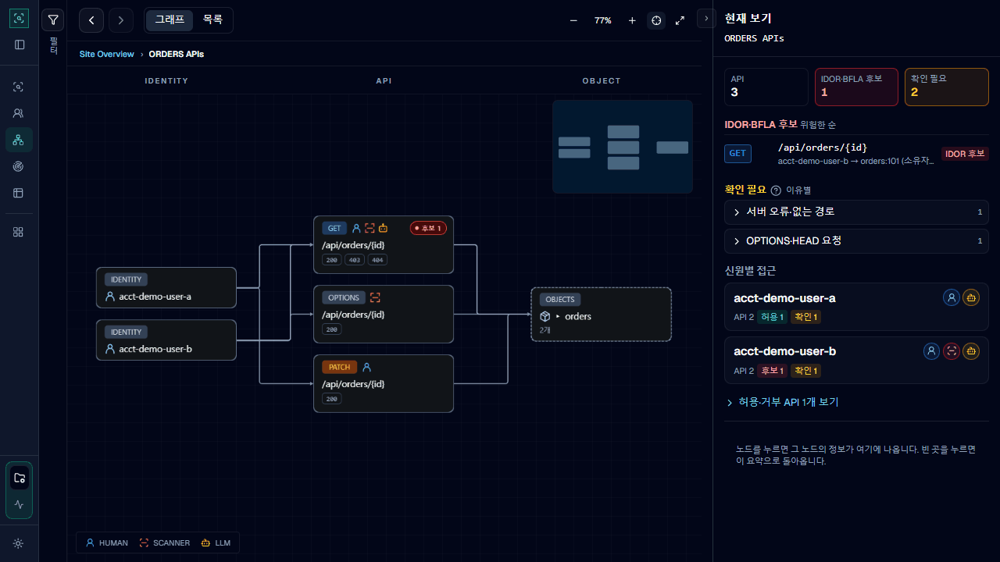
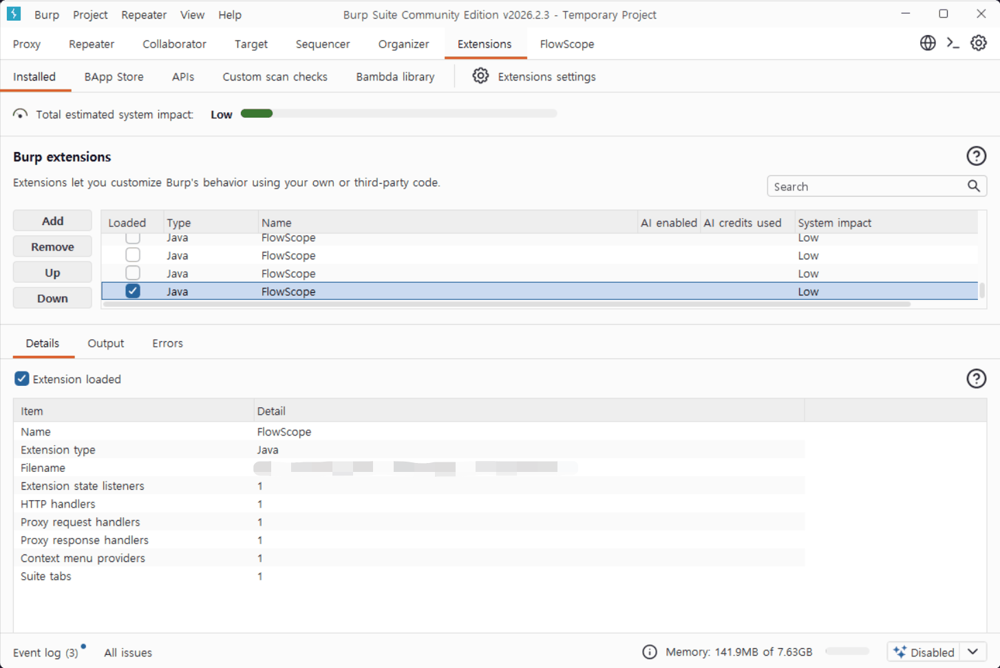
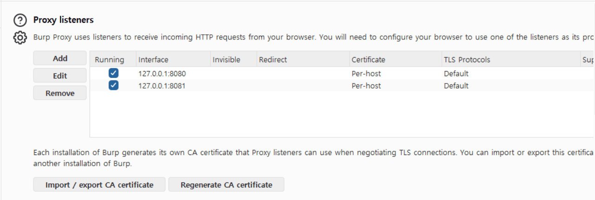
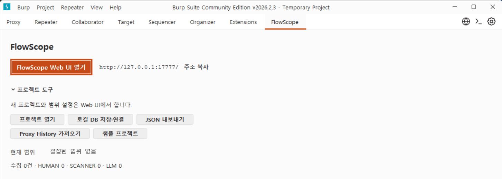
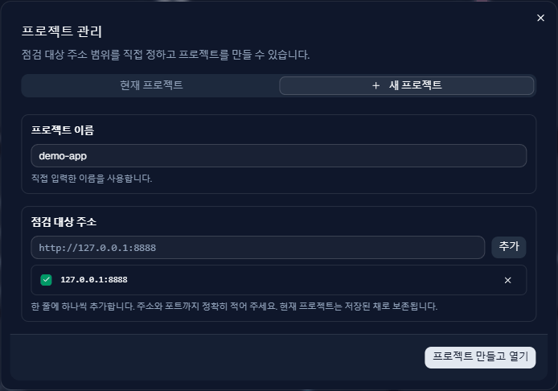
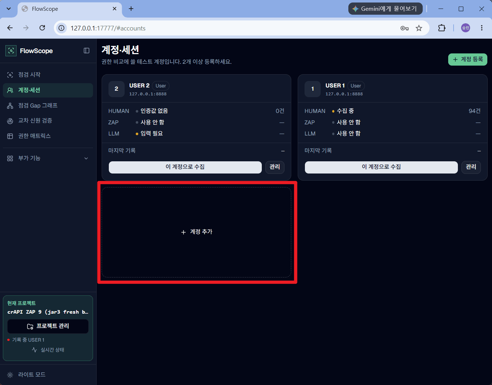
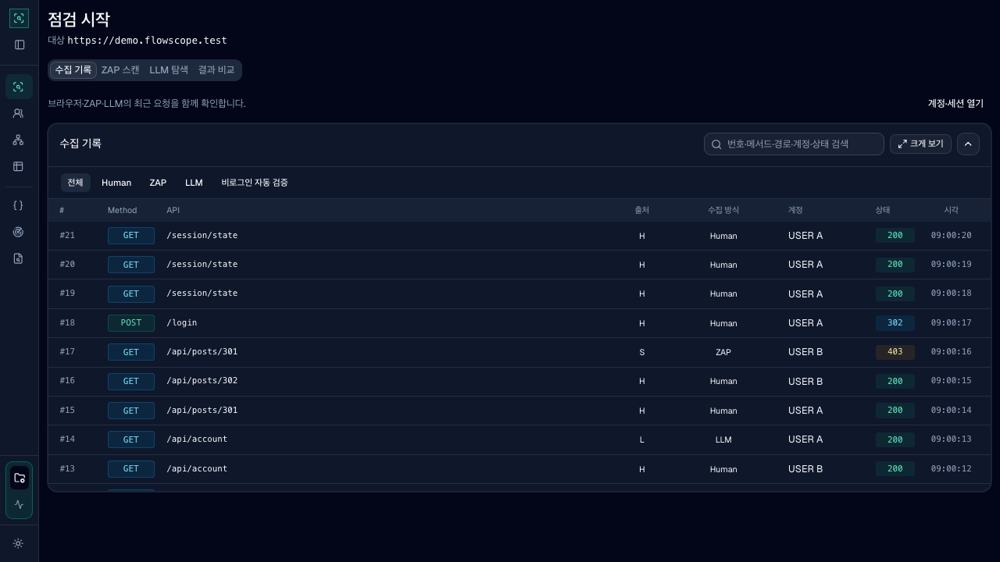
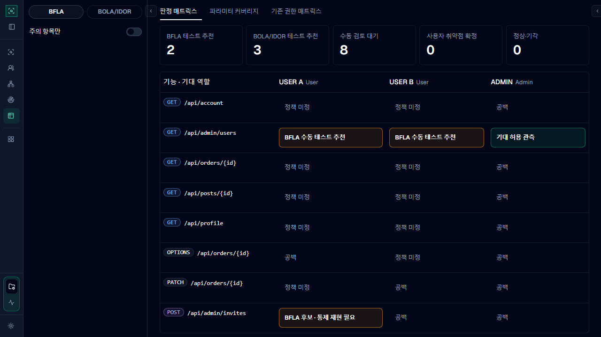

# FlowScope

FlowScope는 Burp Suite 확장 프로그램입니다. 사람이 직접 둘러보며 보낸 요청, ZAP 스캐너가 보낸 요청, AI(LLM)가 보낸 요청을 한 그래프에 모아서 보여 줍니다. 이걸로 누가 어떤 API를 놓쳤는지, 그리고 내 계정으로 다른 사람의 데이터나 관리자 기능에 접근되는 곳이 있는지 찾습니다.



> [!WARNING]
> 직접 운영하거나 점검 허가를 받은 시스템에만 사용하세요. FlowScope는 대상 서버에 실제로 요청을 보냅니다. 운영 중인 서비스나 실제 사용자 계정에는 쓰지 말고 테스트 계정만 쓰세요.

[설치](#설치) | [첫 점검](#첫-점검) | [화면 읽는 법](#화면-읽는-법) | [문서 목록](docs/README.md) | [변경 기록](docs/releases/README.md) | [문제 해결](docs/troubleshooting.md)

## 왜 FlowScope인가

권한 취약점을 찾으려면 두 가지를 해야 합니다. 먼저 서비스의 API를 최대한 많이 찾고, 그다음 찾은 API를 다른 계정으로 보내서 제대로 막히는지 확인합니다.

[Autorize](https://github.com/Quitten/Autorize)나 [AuthMatrix](https://github.com/SecurityInnovation/AuthMatrix) 같은 Burp 확장은 두 번째 일을 잘합니다. 이미 찾은 요청을 다른 계정으로 다시 보내서 결과를 비교해 줍니다. FlowScope는 첫 번째 일도 함께 봅니다. 사람, ZAP, AI가 각각 어떤 API를 찾았고 무엇을 놓쳤는지 보여 주기 때문에, 다른 계정으로 확인해 볼 API가 더 많아집니다.

FlowScope는 응답 코드(200, 403 같은 숫자) 하나만 보고 취약하다고 판단하지 않습니다. 응답 내용과 그 데이터의 주인이 누구인지까지 보고 의심되는 곳을 "후보"로 알려 줍니다. 취약점인지는 사람이 최종 판단합니다. AI는 API를 찾는 일만 하고 판단은 하지 않습니다.

## 할 수 있는 것

- 사람, ZAP, AI가 찾은 API를 한 화면에서 비교합니다.
- 아직 아무도 확인하지 않은 API나 계정 조합을 따로 모아서 보여 줍니다. 화면에서는 이걸 Gap이라고 부릅니다.
- 계정마다 어떤 기능과 데이터에 접근했는지 표로 보여 줍니다. 이 표를 권한 매트릭스라고 부릅니다.
- 한 계정으로 보낸 요청을 다른 계정이나 로그인하지 않은 상태로 다시 보내서 결과를 비교합니다. 데이터를 바꾸지 않는 GET, HEAD 요청만 자동으로 보내고, 나머지는 Burp Repeater에 열어 두어 직접 보내게 합니다.
- 화면에 나온 결과마다 실제로 오간 요청과 응답 원본을 바로 열어 볼 수 있습니다. 쿠키나 토큰 같은 값은 저장하기 전에 가립니다.

## 요구사항

| 쓰려는 기능 | 필요한 것 |
|---|---|
| 사람이 직접 점검 | [Burp Suite Community](https://portswigger.net/burp/communitydownload) 또는 Professional 최신 버전 |
| ZAP 스캔까지 | Docker. Windows와 macOS는 Docker Desktop, Linux는 Docker Engine과 Compose v2가 필요합니다. Windows는 PowerShell 7도 필요합니다. ZAP은 따로 설치하지 않습니다 |
| LLM 탐색까지 | OpenAI의 공식 Codex CLI와 ChatGPT 유료 계정(Plus, Pro, Business, Edu, Enterprise) |
| 소스에서 직접 빌드 | JDK 21과 Maven 3.9. [소스 빌드와 데모](docs/guide/build-from-source.md)를 보세요 |

팀에서 확인한 버전은 Burp Community `2026.7.3`, ZAP `2.17.0`, JDK `21`입니다. 다른 버전에서도 동작할 수 있지만 보장하지는 않습니다.

## 설치

### 1. 내려받기

[Releases](https://github.com/TokenManiZo/flowscope/releases)에서 최신 버전을 받습니다. 저장소가 비공개라서 권한이 있는 GitHub 계정으로 로그인해야 보입니다. 로그인하지 않으면 404 페이지가 나옵니다.

처음이라면 `flowscope-<버전>-bundle.zip`을 받으세요. JAR 파일과 ZAP 실행 파일, 환경 점검 스크립트가 모두 들어 있습니다. `flowscope-<버전>.jar`는 JAR만 바꿔 끼우는 업그레이드나 ZAP 없이 쓸 때 받으면 됩니다. 함께 올라온 `SHA256SUMS.txt`로 받은 파일이 손상되지 않았는지 확인할 수 있습니다.

소스를 직접 빌드할 필요는 없습니다. 같은 소스로 빌드하면 항상 같은 JAR이 나오기 때문에, 의심스러우면 [소스 빌드](docs/guide/build-from-source.md)로 직접 만들어서 SHA-256 값을 비교해 보면 됩니다.

Windows는 인터넷에서 받은 PowerShell 스크립트를 기본으로 막습니다. zip을 푼 폴더에서 PowerShell을 열고 아래 명령을 한 번 실행하세요.

```powershell
Get-ChildItem -Recurse | Unblock-File
```

### 2. Burp에 FlowScope 추가하기

Burp에서 **Extensions → Installed → Add**를 누르고, Extension type은 **Java**로 둔 채 JAR 파일을 고릅니다. 예전 버전의 FlowScope가 있으면 먼저 지웁니다.



위는 추가한 뒤의 설치 목록입니다. FlowScope 항목이 여러 개 남아 있다면 예전 항목은 지우고 하나만 사용하세요.

잘 추가되면 Burp 위쪽에 **FlowScope** 탭이 생깁니다.

### 3. 프록시 리스너 확인하기

Burp **Settings → Tools → Proxy → Proxy listeners**에서 Burp 브라우저가 쓰는 리스너(보통 `127.0.0.1:8080`)가 켜져 있는지 봅니다. 따로 만들 필요는 없습니다.

ZAP을 쓸 거라면 **Add**를 눌러 포트 `8081`, **Loopback only**로 리스너를 하나 더 만듭니다. ZAP이 보내는 요청은 이 리스너를 거쳐야 FlowScope에 기록됩니다. Linux에서 Docker Engine을 쓴다면 Docker bridge IP에도 `8081` 리스너가 하나 더 필요합니다([자세히](docs/guide/inspection-flow.md#상세-동작과-정확성-경계)).



### 4. Docker 설치하기 (ZAP을 쓸 때만)

FlowScope는 ZAP을 Docker 컨테이너로 띄웁니다. Docker가 없으면 먼저 설치합니다.

| OS | 설치 안내 |
|---|---|
| Windows | [Docker Desktop for Windows](https://docs.docker.com/desktop/setup/install/windows-install/). WSL 2와 BIOS 가상화가 켜져 있어야 합니다 |
| macOS | [Docker Desktop for Mac](https://docs.docker.com/desktop/setup/install/mac-install/) |
| Linux | [Docker Engine](https://docs.docker.com/engine/install/)과 Compose 플러그인 |

설치가 끝나면 Docker Desktop을 켜 두고, 터미널에서 `docker compose version`을 실행해 `v2`로 시작하는 버전이 나오는지 확인합니다. Docker Desktop은 개인, 교육, 소규모 조직(직원 250명 미만이면서 연매출 1천만 달러 미만)에서는 무료입니다.

### 5. ZAP 켜기 (ZAP을 쓸 때만)

ZAP은 따로 내려받지 않습니다. zip을 푼 폴더에서 아래 명령 하나만 실행하면 나머지는 알아서 처리합니다.

```bash
./scripts/zap-up.sh
```

```powershell
.\scripts\zap-up.ps1
```

이 명령은 다음 일을 합니다.

1. Docker와 Compose v2가 있는지 확인합니다.
2. ZAP API key를 만들어 `~/.flowscope/zap-api-key`에 저장합니다. FlowScope가 이 파일을 알아서 읽습니다.
3. 공식 ZAP 2.17.0 이미지(`ghcr.io/zaproxy/zaproxy`)를 내려받고, 여기에 Chromium과 ChromeDriver를 더한 FlowScope용 이미지를 내 PC에서 만듭니다. 처음 한 번만 시간이 오래 걸리고 인터넷이 필요합니다. 다 만들어진 이미지는 약 4.3GB입니다.
4. 컨테이너를 띄웁니다. ZAP API는 내 PC(`127.0.0.1:8089`)에서만 열리고, ZAP이 대상 서버로 보내는 요청은 Burp `8081` 리스너를 거칩니다.

`FlowScope ZAP is ready at http://127.0.0.1:8089.`가 나오면 끝입니다. 끌 때는 `zap-down`을 실행합니다. PC에 ZAP Desktop이 설치돼 있어도 FlowScope는 그걸 쓰지 않습니다. 같이 켜 두면 Burp와 `8080` 포트가 겹칠 수 있으니 꺼 두세요.

### 6. Codex 설치하기 (LLM 탐색을 쓸 때만)

LLM 탐색은 OpenAI의 공식 Codex CLI로 돌아갑니다. API key는 필요 없고 ChatGPT 계정으로 로그인합니다.

```bash
curl -fsSL https://chatgpt.com/codex/install.sh | sh
```

```powershell
powershell -ExecutionPolicy ByPass -c "irm https://chatgpt.com/codex/install.ps1 | iex"
```

npm(`npm install -g @openai/codex`)이나 Homebrew(`brew install --cask codex`)로 설치해도 됩니다. 설치한 다음에는 이렇게 합니다.

1. Burp를 실행하는 것과 **같은 OS 사용자**로 새 터미널을 열고 `codex`를 실행합니다. **Sign in with ChatGPT**를 골라 로그인합니다.
2. `codex login status`로 로그인이 됐는지 확인합니다.
3. Burp가 켜져 있었다면 껐다가 다시 켭니다. 설치하면서 바뀐 PATH는 새로 켠 프로그램에만 반영되기 때문입니다.

웹 화면의 **점검 시작 → 3 · LLM 탐색**에 **Codex 준비됨**이 보이면 됩니다. 자세한 설치 방법은 [Codex CLI 공식 문서](https://learn.chatgpt.com/docs/codex/cli)에 있습니다.

### 7. 환경 점검하기

설치가 제대로 됐는지 스크립트로 확인합니다. `human`, `zap`, `explorer`, `full` 중에서 쓰려는 기능에 맞춰 고르면 됩니다. `explorer`는 Codex 설치와 로그인을 확인합니다.

```bash
./scripts/doctor.sh --mode full
```

```powershell
.\scripts\doctor.ps1 -Mode full
```

이 스크립트는 내 PC의 포트와 ZAP 설정까지만 확인합니다. Linux에서 컨테이너가 Burp의 bridge 리스너까지 닿는지는 확인하지 못합니다.

### 업그레이드

먼저 지금까지 한 점검을 저장합니다. Burp **FlowScope** 탭의 **로컬 DB 저장·연결**이나 **JSON 내보내기**를 쓰면 됩니다. 그다음 예전 FlowScope를 지우고 새 JAR 하나만 추가합니다. 버전마다 바뀐 점과 주의할 점은 [변경 기록](docs/releases/README.md)에 있습니다.

## 첫 점검

화면부터 구경하고 싶다면 Burp **FlowScope** 탭의 **샘플 프로젝트**를 누르세요. 실제 서버에 요청을 보내지 않는 연습용 데이터가 열립니다.

### 1. 웹 화면 열기

Burp **FlowScope** 탭 오른쪽 위의 **FlowScope Web UI 열기**를 누릅니다. 브라우저 주소창에 `http://127.0.0.1:17777/`을 직접 입력해도 됩니다.



### 2. 점검 범위 정하기

웹 화면 왼쪽 아래의 **프로젝트 관리**를 누르고 **새 프로젝트** 탭으로 갑니다. **점검 대상 주소**에 점검할 서비스 주소를 넣고 **추가**를 누른 다음, **프로젝트 만들고 열기**를 누릅니다.



주소는 `http://127.0.0.1:8888`처럼 포트까지 정확히 적습니다. 여기 넣은 주소로 오가는 요청만 기록되고, 다른 사이트를 돌아다닌 기록은 저장하지 않습니다. 프로젝트 이름을 비워 두면 첫 번째 주소로 이름이 정해집니다.

### 3. 계정 등록하기 (선택)

로그인한 사용자끼리 권한을 비교하고 싶을 때만 하면 됩니다. **계정·세션 → 계정 등록**에서 테스트 계정을 등록합니다. 여기에는 이름과 역할만 적고 비밀번호는 넣지 않습니다. 내 계정으로 다른 사람의 데이터가 보이는지 확인하려면 계정이 2개 이상 필요합니다.



로그인하지 않은 상태로만 둘러볼 거라면 건너뛰세요. 다음 단계에서 계정 대신 **비로그인**을 고르면 됩니다.

계정을 등록한 뒤 로그인 연결을 관리하는 방법은 [계정의 HUMAN 인증값 관리](docs/reference/screens.md#계정의-human-인증값-관리)에 있습니다.

### 4. 점검 시작하기

**점검 시작** 화면에서 단계를 차례로 진행합니다. ZAP과 LLM 단계는 건너뛰어도 됩니다.



**1 · 직접 둘러보기**
수집할 계정(또는 비로그인)을 고르고 **시작**을 누릅니다. Burp에서 **Proxy → Intercept → Open browser**로 브라우저를 열고 서비스를 평소처럼 사용합니다. 다 둘러봤으면 **종료**를 누릅니다. Intercept가 켜져 있으면 요청이 멈추니 꺼 두세요. 다른 계정으로 바꿀 때는 꼭 종료하고 다시 시작해야 합니다.

**2 · ZAP 스캔**
비로그인 또는 ZAP 로그인을 설정해 둔 계정을 고르고 **스캔 시작**을 누릅니다. ZAP 로그인 정보는 **계정·세션**에서 계정의 **관리 → ZAP 로그인**에 넣고, **로그인 검증**으로 먼저 확인해 보세요.

**3 · LLM 탐색**
계정마다 **브라우저 로그인**을 누르면 새 브라우저 창이 뜹니다. 그 창에서 직접 로그인하고 **로그인 완료**를 누른 뒤 **탐색 시작**을 누릅니다. 비로그인으로만 탐색해도 됩니다.

**Codex 모델**에서 이번 탐색에 쓸 모델을 고를 수 있습니다. PC 전체의 Codex 설정은 바뀌지 않습니다. 실행 중에는 바꿀 수 없고, 완료 후 다음 탐색의 모델을 다시 고를 수 있습니다.

**4 · 결과 비교**
사람, ZAP, AI가 각각 찾은 API를 나란히 비교합니다.

### 5. 결과 보기

**점검 Gap 그래프**에서 빨간 "후보" 표시가 붙은 API를 열어 봅니다. **권한 매트릭스**에서는 계정별로 어떤 결과가 나왔는지 보고, 의심되는 칸은 Burp Repeater로 열어서 직접 보내 확인합니다.

단계마다 더 자세한 동작은 [점검 흐름 상세](docs/guide/inspection-flow.md)에 있습니다.

## 화면 읽는 법

처음 보면 낯선 말부터 정리합니다.

| 화면에 나오는 말 | 뜻 |
|---|---|
| HUMAN, SCANNER, LLM | 요청을 보낸 쪽입니다. 사람(Burp 브라우저), ZAP 스캐너, LLM 탐색 순서입니다 |
| 관측 기록 | 실제로 오간 요청과 응답 원본입니다 |
| Gap | 아직 확인하지 않은 곳입니다. 예를 들어 한 계정으로만 열어 본 API가 여기에 들어갑니다 |
| 일부만 발견 | 사람, ZAP, AI 중 일부만 찾은 API입니다 |
| IDOR, BOLA | 내 계정으로 다른 사람의 데이터(주문, 게시글 등)를 보거나 바꿀 수 있는 취약점입니다 |
| BFLA | 일반 사용자가 관리자 기능을 쓸 수 있는 취약점입니다 |

그래프에서는 이렇게 표시합니다.

- 빨간 **후보 N**: 그 API에 IDOR나 BFLA로 의심되는 곳이 N개 있습니다.
- 노란 **확인 필요**: 판단하기에 근거가 부족한 곳입니다. 오른쪽 패널에서 이유를 볼 수 있습니다.
- 초록 **문제 없음**: 지금까지 모은 기록으로는 의심되는 곳이 없는 API 묶음입니다.

**권한 매트릭스**는 열이 계정이고, 행이 기능(BFLA) 또는 데이터(BOLA/IDOR)입니다. 칸을 누르면 오른쪽에서 역할과 정책을 정하고, Burp Repeater로 보내고, 최종 판정을 남길 수 있습니다.



칸에 나오는 말은 이런 뜻입니다.

- **테스트 추천**: 직접 보내서 확인해 볼 만한 조합입니다.
- **후보**: 의심되는 근거가 모인 조합입니다. 사람이 확인해야 합니다.
- **기대 허용 관측**: 허용돼야 하는 접근이 실제로 허용됐습니다.
- **정책 미정**: 이 기능을 누가 써도 되는지 아직 정하지 않았습니다.
- **공백**: 이 조합으로 보낸 요청이 아직 없습니다.

공백이나 Gap은 "아직 안 봤다"는 뜻이지 취약하다는 뜻이 아닙니다. 서비스 전체에 API가 몇 개인지는 밖에서 알 수 없어서, 점검을 몇 % 했는지 같은 숫자는 보여 주지 않습니다. 그래프에서 API를 고르고 실제 요청 기록까지 확인하는 과정은 [화면별 설명](docs/reference/screens.md#그래프에서-기록-확인하기)에 있습니다.

그래프 상단의 검색창에서 서비스, API 경로·메서드, 객체 ID, 신원, 자동 묶음을 찾을 수 있습니다. 다른 계층이나 접힌 묶음, 18개 표시 제한 밖의 대상도 검색합니다. 결과를 고르면 해당 노드를 보여 주며 기존 배치는 유지합니다. 결과는 종류와 이름 한 줄로 구분하고, 같은 이름이 여러 서비스에 있으면 `host:port`를 표시합니다. 검색을 지우면 임시 강조만 사라지고, 추가 표시한 노드는 **해제** 또는 **18개로 접기**로 정리합니다. 갱신 후 없어진 대상은 결과에서 빠지고, 일치하는 항목이 없으면 결과 없음으로 표시합니다.

Request Lab은 상단에서 인증·글자 크기(12·14·16·18px)·창/패널 확대를 조절합니다. 요청·응답은 각 박스 안에서 스크롤하고, 가운데 분할선은 드래그·방향키로 조절합니다. JSON 정돈은 숫자·문자열 표현을 보존하는 읽기 전용 보기이며 전송은 항상 Raw 요청을 사용합니다. 기본 14px, 정돈 한도는 본문 256KiB·중첩 128단계·출력 1MiB입니다. 확대 중 Esc는 기본 창으로 돌아갑니다.

## 데이터와 안전

- 프로젝트는 `~/.flowscope/projects/` 아래 SQLite 파일로 30초마다 자동 저장됩니다. 저장하기 전에 Authorization, Cookie, 비밀번호, 토큰 같은 값은 가리지만, 주소나 응답 안의 업무 데이터는 그대로 남을 수 있습니다.
- 비밀번호와 로그인 세션은 프로젝트 파일에 저장하지 않습니다. FlowScope가 켜져 있는 동안 메모리에만 두고, ZAP 로그인 때만 ZAP 컨테이너의 임시 메모리에 잠깐 넘깁니다. 그래서 Burp를 다시 켜면 로그인은 다시 해야 합니다.
- LLM 탐색을 쓰면 대상 페이지와 응답 내용이 Codex를 거쳐 OpenAI 모델로 넘어갑니다. 로그인 정보는 넘기지 않습니다. 민감한 데이터가 있는 대상에는 쓰지 마세요.
- 웹 화면은 내 PC(`127.0.0.1`)에서만 열립니다. 다른 PC에서는 접속할 수 없습니다.
- ZAP의 공격형 스캔(Active Scan, Fuzzer)은 돌리지 않습니다. 다른 계정으로 다시 보내는 기능은 GET, HEAD 요청만 자동으로 보냅니다. LLM 탐색은 조회나 검색용 POST 요청까지 보낼 수 있으니 테스트 환경에서만 쓰세요.

판정 기준과 알려진 한계는 [판정 규칙·데이터 처리·한계](docs/reference/trust-and-limits.md)에 있습니다.

프로젝트 형식이나 DB 구조의 버전 오류가 나오면 안내된 파일 버전과 현재 지원 범위를 확인하고, 해당 형식을 지원하는 JAR로 다시 열어 주세요. 파일의 버전 번호를 직접 바꾸면 데이터가 누락될 수 있습니다.

## 더 읽기

| 문서 | 이럴 때 보세요 |
|---|---|
| [점검 흐름 상세](docs/guide/inspection-flow.md) | 리스너, 점검 범위, 계정 세션, ZAP과 LLM 단계가 어떻게 동작하는지 알고 싶을 때 |
| [화면별 설명](docs/reference/screens.md) | 메뉴마다 무엇을 하는 화면인지 알고 싶을 때 |
| [기능 상세](docs/reference/features.md) | 무엇을 모으고 어떻게 분석하는지 알고 싶을 때 |
| [포트·설정·출처 모델](docs/reference/settings.md) | 포트를 바꾸거나 ZAP API key 위치를 알고 싶을 때 |
| [판정 규칙·데이터 처리·한계](docs/reference/trust-and-limits.md) | 어떤 기준으로 후보를 고르고 무엇을 저장하는지 알고 싶을 때 |
| [문제 해결](docs/troubleshooting.md) | 오류 문구가 나오거나 기록이 쌓이지 않을 때 |
| [변경 기록](docs/releases/README.md) | 버전마다 무엇이 바뀌었는지 볼 때 |
| [소스 빌드와 데모](docs/guide/build-from-source.md) | 직접 빌드하거나 Burp 없이 화면만 보고 싶을 때 |

## 라이선스와 보안

MIT License로 공개합니다. 화이트햇스쿨 토큰많이조가 만들었습니다. 함께 들어 있는 라이브러리의 라이선스 고지는 JAR 안의 `META-INF/`에 있습니다.

취약점을 발견하면 공개 이슈 대신 [SECURITY.md](SECURITY.md)의 비공개 신고 절차를 따라 주세요.
