# **AI-API 플로우 취약점 기능명세서**

> 이 문서는 F-01~F-24의 원본 기능 요구와 참조 화면을 보존한다. 현재 제품 행동과 신뢰 경계의 정본은 루트 `README.md`, `docs/ko/architecture.md`, `docs/ko/decisions.md`다.

**화이트햇스쿨 2단계 팀 프로젝트, 토큰많이조**

사람, 스캐너, LLM 세 관측 소스의 API 점검 플로우를 한 그래프에 겹쳐, 어떤 소스는 찾고 어떤 소스는 놓쳤는지 비교하여 IDOR 등 로지컬 취약점을 더 쉽게 찾는 도구입니다. 일정, 담당, 진척은 WBS에서 관리합니다.

<table>
<colgroup>
<col style="width: 100%" />
</colgroup>
<thead>
<tr class="header">
<th>
<strong>[프로토타입 단계 안내]</strong>

본 문서는 현재 프로토타입 단계의 기능명세서로, 구현 및 검증 과정에 따라 UI 구성, 세부 동작 흐름, 데이터 표현 방식 및 일부 기능 범위가 변경될 수 있습니다. 첨부된 화면은 기능 이해를 위한 프로토타입 예시이며 최종 화면과 다를 수 있습니다.
</th>
</tr>
</thead>
<tbody>
</tbody>
</table>

# 1. 전체 동작 흐름

**동작 흐름 개요**

**1. 트래픽 수집** : 사람,스캐너,LLM(포트), XML 폴백
**2. 정규화** : 엔드포인트,요청자,객체
**3. 그래프 구성** : 관계망 + 소스별 디자인
**4. 판정** : 소스별 5단계
**5. 커버리지와** 갭 : 3-way 비교
**6. 시나리오 제안** : 전체 그림 종합
**7. 재전송(검증)** : 노드 변조 재전송
**8. 시각화** : 겹쳐보기,필터,상세,재전송
++ 7단계(재전송) 결과는 4단계(판정)에 갱신되어 반영될 수 있습니다.

## 관측 주체 (소스) 및 재전송

| **표식**     | **성격**                           | **수집 방식**                                          |
|--------------|------------------------------------|--------------------------------------------------------|
| **사람**     | 실제 요청과 응답 관측              | 포트번호로 구분                                        |
| **스캐너**   | 실제 요청과 응답 관측              | 포트번호로 구분                                        |
| **LLM**      | 실제 요청과 응답 관측              | 전용 Burp Proxy 포트로 실시간 캡처 (XML 업로드는 폴백) |
| 재전송(검증) | 사후 검증용 (관측 주체(소스) 아님) | 노드에서 변조 재전송, 별도 기록                        |

## 단계별 정의

| **단계** | **이름**               | **무엇을 하는가**                                                                                                                                                                                                                  | **선행 조건**                | **산출물**                                       |
|----------|------------------------|------------------------------------------------------------------------------------------------------------------------------------------------------------------------------------------------------------------------------------|------------------------------|--------------------------------------------------|
| 1        | **트래픽 수집**        | 사람, 스캐너, LLM세 관측 소스의 점검 트래픽을 포트번호로 구분해 실시간 수집한다. LLM은 로컬 에이전트를 전용 Burp Proxy 포트로 연결해 스코프 검사를 통과한 요청과 응답만 관측하며, 실시간 수집이 어려운 경우 XML 업로드로 대체한다. | 점검 대상 트래픽 확보        | 출처(사람/스캐너/LLM)가 태깅된 요청 기록         |
| 2        | **정규화**             | 요청을 분석 가능한 형태로 변환한다. 엔드포인트를 합치고, 요청자를 식별하고, 접근 대상 객체를 추출하며, 소유자는 판정용 속성으로 추정한다.                                                                                          | 1단계 완료                   | Identity, Operation, Resource가 부착된 요청 기록 |
| 3        | **그래프 구성**        | 정규화된 기록을 노드와 엣지로 연결해 관계망을 만든다. 세 소스를 한 그래프에 겹치되 소스별로 다른 디자인을 적용해 구별한다.                                                                                                         | 2단계 완료                   | 소스가 구별된 플로우 그래프                      |
| 4        | **판정**               | 각 접근 조합을 소스별로 5단계 판정한다. 소유권과 응답을 함께 본다.                                                                                                                                                                 | 3단계 완료, 소유자 추정 존재 | 소스별 조합 판정 결과                            |
| 5        | **커버리지와 갭 산출** | 세 소스가 밟은 조합을 계산하고, 어떤 소스는 찾고 어떤 소스는 놓쳤는지 3-way로 비교하고, 관측한 신원과 객체 중 아직 안 엮은 조합(미교차)을 도출한다.                                                                                | 4단계 완료                   | 커버리지 수치, 소스별 갭과 불일치 목록           |
| 6        | **시나리오 제안**      | 사람, 스캐너, LLM 전체 그림을 종합해 새로운 공격 시나리오를 제안받는다.                                                                                                                                                            | 5단계 완료, 민감정보 마스킹  | 시나리오 후보 목록                               |
| 7        | **재전송 및 검증**     | 그래프 노드에서 직접 파라미터와 값을 변조해 요청을 다시 보내고 결과를 확인한다. 관측 소스와 구분해 재전송 표식으로 따로 기록한다.                                                                                                  | 사용자 확인, 스코프 내 대상  | 재전송 요청과 응답 기록(별도 표식)               |
| 8        | **시각화**             | 세 소스 그래프를 겹쳐 보거나 소스별로 걸러 보고, 노드 선택 시 요청과 응답 상세와 재전송 도구를 제공한다.                                                                                                                           | 3~5단계 결과 존재            | 그래프 뷰, 매트릭스 뷰, 상세와 재전송 패널       |

## 핵심 원칙

- 관측 소스는 사람, 스캐너, LLM이며 셋 다 실제 요청과 응답을 가집니다.

- 커버리지는 밟았는가, 판정은 맞게 보았는가로 서로 다른 축입니다.

- 기록이 없는 조합은 접근 불가가 아니라 아직 시도 안 함으로 해석합니다.

- 재전송(검증) 결과는 사람, 스캐너, LLM 관측과 묶지 않고 별도의 표식으로 관리합니다.

- 어떤 요청도 스코프 밖으로 나가지 않으며, 재전송은 사용자 확인을 거칩니다.

- 추정으로 얻은 값과 검증으로 확인한 값은 항상 구분해 표시합니다.

- LLM 관측은 전용 Burp Proxy 경로에서 Protocol, Host, Port, Path로 스코프를 강제 검사하며, 정상 허용 범위를 벗어난 요청은 LLM의 판단과 무관하게 차단합니다.

- 트래픽 수집, 정규화, 판정, 커버리지 갭은 규칙 기반으로 동작하고, AI는 그 결과를 종합하여 시나리오를 제안합니다.

# 2. 기능명세

## 1. 트래픽 수집

### F-01 : 트래픽 수집

수동 점검(사람), 자동 점검(스캐너), LLM 점검 트래픽을 포트번호로 구분하여 실시간 수집한다. LLM은 Claude Code, Codex CLI 같은 기존 로컬 에이전트를 실행 기반으로 삼고, 그 위에 점검 프롬프트, 스코프 검증, 요청 실행, 결과 수집 규칙을 얹은 하네스로 구성한다(에이전트 지침은 CLAUDE.md, AGENTS.md 등으로 관리). 모델 추론은 제공사 서버에서 돌지만 실제 HTTP 요청은 사용자 PC에서 나가므로, 전용 Burp Proxy 포트로 사람, 스캐너와 동일하게 실측 관측한다.

**사용자 흐름**

1. 사람, 스캐너, LLM 포트 설정 확인
2. 트래픽 인입 (LLM은 로컬 에이전트로 점검 실행)
3. 포트 기준으로 출처 자동 분류
4. 탐색 주체 별 스캔 건수 확인

| **입력값**                             | **출력값**                               |
|----------------------------------------|------------------------------------------|
| 요청 트래픽, 사람/스캐너/LLM 포트 매핑 | 출처(사람/스캐너/LLM)가 태깅된 요청 기록 |

**조건 및 예외 처리**

- 매핑되지 않은 포트의 트래픽은 출처 미상으로 분류하고 사용자에게 확인 요청

- 같은 요청이 여러 소스에서 관측되면 각각 기록하고 겹침으로 처리

- 포트 매핑은 사용자가 수정할 수 있어야 함

- LLM 전용 경로는 실제 요청이 나갈 때마다 Protocol, Host, Port, Path로 목적지를 검사하고, 스코프를 벗어난 요청은 LLM 판단과 무관하게 강제 차단(리다이렉트 시 변경된 목적지의 스코프 포함 여부도 확인)

- 스코프 검사를 통과한 요청과 응답만 LLM 관측으로 수집하고, 프록시를 태울 수 없으면 F-02(XML)로 폴백

- 시스템 ZAP 기준선은 outgoing proxy가 FlowScope scanner listener인지 먼저 확인하고 신원별 fresh session에서 선택 target subtree 전용 Context, passive engine·전체 passive rule·scope-only를 적용한다. 운영자가 명시한 exact-scope OpenAPI·GraphQL·Postman·SOAP 정의는 bounded import한 뒤 Traditional, Client, AJAX Spider를 모두 실행하고 passive queue와 native Alert를 수집한다. 정의 위치를 추측하지 않으며 필수 add-on·upstream·Context·passive rule 검사가 실패하면 대상 전송 전에 차단한다. Active Scan·Fuzzer·Forced Browse는 기본 기준선에 포함하지 않는다.
- 독립 LLM Explorer의 GET·HEAD·OPTIONS와 상태 변경 요청은 별도 MCP 도구로 분리한다. write method는 확인·Burp 승인을 요구하고, 같은 EXPLORATION run의 범위 내 응답 Evidence가 한 건 이상 없으면 run 종료와 LLM lane 완료를 허용하지 않는다. Codex 실행은 사용자 skill·plugin·외부 browser surface를 실행별로 끄되 사용자 설정 파일을 변경하지 않는다.

**관련 화면**

  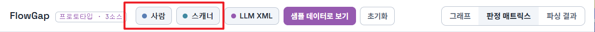

### F-02 : LLM 트래픽 수집

전용 Burp Proxy 포트로 실시간 수집이 어려운 환경(클라우드 에이전트, 오프라인 배치 실행 등)을 위한 보조 수집 방식. LLM이 만든 요청과 응답 기록을 XML 파일로 받아 업로드한다.

**사용자 흐름**

1. LLM에 점검 기록 XML 요청
2. 파일 업로드
3. 파싱과 검증
4. 관측 건수 확인

| **입력값**        | **출력값**                   |
|-------------------|------------------------------|
| LLM 점검 기록 XML | 출처(LLM)가 태깅된 요청 기록 |

**조건 및 예외 처리**

- 각 항목이 실제 응답을 포함하는지 검증하고, 응답이 없는 항목은 관측이 아니라 후보로 분리

- 형식 오류 항목은 건너뛰고 사유 표시

- LLM 요청도 점검 범위(스코프) 내인지 확인

- 실제 요청과 응답 없이 LLM이 제안만 한 항목은 관측과 분리해 후보로 관리하고, 필요 시 재전송과 검증(F-18~F-19)에서 사용자가 확인

**관련 화면**

  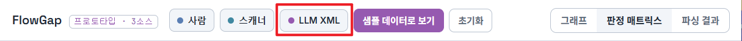

### F-03 : 출처 관리

모든 요청을 사람, 스캐너, LLM 중 하나로 표시한다. 세 소스 비교의 전제가 된다.

**사용자 흐름**

1. 수집 경로에 따라 자동 태깅
2. 목록에서 출처 배지로 확인

| **입력값**           | **출력값**                         |
|----------------------|------------------------------------|
| 요청 기록, 수집 경로 | 세 출처 중 하나가 부착된 요청 기록 |

**조건 및 예외 처리**

- 출처를 판별할 수 없으면 미상으로 표시하고 커버리지에서 제외

- 재전송으로 생성된 요청은 관측 소스가 아니라 재전송 표식으로 분리(F-19 참조)

**관련 화면**

  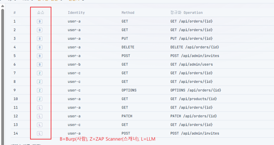

## 2. 정규화

### F-04 : Endpoint 분석

경로의 객체 식별자를 자리표시자로 바꿔 같은 기능의 요청을 하나로 묶는다.

(ex. GET /orders/101, GET/orders/123 -\> GET /orders/{id})

**사용자 흐름**

1. 수집 후 자동 실행
2. 정규화 결과 확인

| **입력값**        | **출력값**                                 |
|-------------------|--------------------------------------------|
| 요청 메서드, 경로 | 정규화된 엔드포인트 (예: GET /orders/{id}) |

**조건 및 예외 처리**

- 메서드가 다르면 다른 엔드포인트로 취급

- 쿼리 문자열은 경로에서 분리

- 식별자로 보이지 않는 부분은 원형 상태 유지

**관련 화면**

  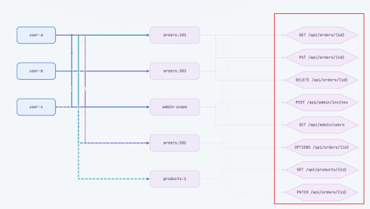

### F-05 : 사용자 분석 

요청 헤더의 세션 쿠키나 인증 토큰을 기준으로 요청자를 구분하고, 같은 인증 정보를 사용하는 요청에 동일한 사용자 라벨을 부여한다.

**사용자 흐름**

1. 자동 실행
2. 식별된 사용자 수 확인
3. 필요 시 라벨 수정

| **입력값**            | **출력값**                          |
|-----------------------|-------------------------------------|
| 요청 헤더의 인증 정보 | 요청자 라벨 (사용자 A, 사용자 B 등) |

**조건 및 예외 처리**

- 인증 정보가 없으면 비인증 요청으로 분류

- 원문 토큰은 저장하지 않고 변환값만 보관

- 토큰 갱신으로 값이 바뀌어도 동일 사용자로 묶이는지 확인

**관련 화면**

  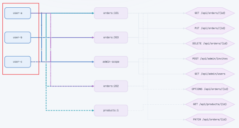

### F-06 : 객체 분석 

요청의 경로, 쿼리 파라미터, 요청 본문에서 객체 식별값을 추출하고, 사전에 정의한 식별 규칙에 따라 접근 대상 객체를 자동 매핑한다.

**사용자 흐름**

1. 자동 실행
2. 추출된 객체 목록 확인

| **입력값**                | **출력값**                 |
|---------------------------|----------------------------|
| 경로, 파라미터, 요청 본문 | 객체 식별자 (예: 주문:202) |

**조건 및 예외 처리**

- 객체 유형은 URL의 리소스 세그먼트 등으로 추론하고, page, limit, offset, sort, 시간, 불리언 등 제어 목적 값은 객체 후보에서 제외(제외 규칙도 사용자가 수정 가능)

- 위치와 형식(리소스명 뒤 세그먼트의 숫자나 UUID, orderId처럼 키에 유형이 명시된 값), 명세 근거(OpenAPI 등의 식별자 파라미터), 교차 검증(요청 ID와 응답 객체 id 일치, 반복 관측)을 가중치로 합산한 신뢰도 점수로 판단

- 신뢰도 점수의 임계값 이상은 자동 매핑, 미만은 객체 후보와 판단 근거를 함께 표시해 사용자가 확인

- 후보가 서로 충돌하거나 근거가 부족하면 미확정으로 두고, 사용자 수정값을 자동 추론보다 우선 적용

- 매핑 결과가 IDOR 판정과 미교차 검출의 근거이므로 자동 추출과 사용자 검수를 결합한 반자동으로 운영

**관련 화면**

  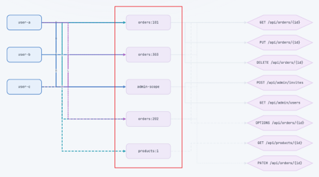

## 3. 그래프 구성

### F-07 : 관계 분석

접근 흐름을 다음과 같은 순서로 배치해, 누가 어떤 대상에 어떤 엔드포인트로 접근했는지 한눈에 보이게 노드와 엣지로 연결한다.

> 1\. 누가 요청했는지 (요청자)
>
> 2\. 어떤 대상에 접근했는지 (객체)
>
> 3\. 어떤 엔드포인트를 호출했는지 (엔드포인트)

객체 소유자는 별도의 마지막 노드로 표시하지 않고(요청자가 이미 맨 앞에 있어 중복) 그 자리에 엔드포인트를 배치하며, 소유자는 판정용 속성으로만 관리한다.

**사용자 흐름**

1. 정규화 후 자동 생성
2. 그래프 화면에서 확인

| **입력값**         | **출력값**                         |
|--------------------|------------------------------------|
| 정규화된 요청 기록 | 노드와 엣지로 구성된 플로우 그래프 |

**조건 및 예외 처리**

- 동일 관계는 하나로 합치고 횟수만 누적

- 소유자 미확정 객체는 소유 관계를 만들지 않음

**관련 화면**

  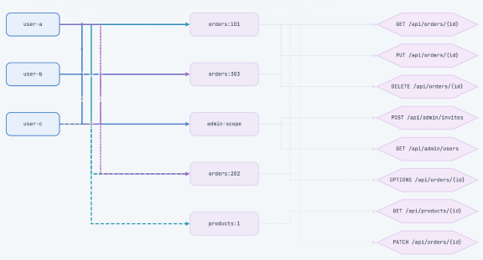

### F-08 : 출처 시각화

사람, 스캐너, LLM 관측을 서로 다른 노드와 엣지 디자인으로 표시해 한 그래프에서 구별한다.

**사용자 흐름**

1. 그래프 생성 시 소스별 스타일 자동 적용
2. 범례로 대응 확인

| **입력값**                | **출력값**             |
|---------------------------|------------------------|
| 출처가 태깅된 그래프 요소 | 소스별로 구별된 그래프 |

**조건 및 예외 처리**

- 세 소스가 같은 조합을 관측하면 겹침을 알아볼 수 있게 표시

- 재전송 표식은 사람, 스캐너, LLM과 또 다른 스타일로 구별

- 각 소스는 전부 다른 색깔과 형태로 구별해 색약 사용자도 식별 가능

**관련 화면**

  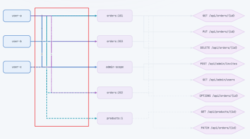

### F-09 : Flow 분석

같은 사용자의 요청 간 객체 ID나 토큰의 전달 관계를 분석하여 데이터 의존성이 있는 요청만 순서 흐름으로 연결한다.

**사용자 흐름**

1. 자동 실행
2. 흐름에서 순서 확인

| **입력값**                               | **출력값**                   |
|------------------------------------------|------------------------------|
| 요청 기록(요청자, 요청과 응답의 ID/토큰) | 데이터 의존성 기반 순서 관계 |

**조건 및 예외 처리**

- 순수 시간순으로 잇지 않고 데이터 의존성(생성 ID나 토큰 사용)을 기준으로 연결한다. 문의게시판 접근 뒤 회원가입처럼 무관한 요청은 데이터를 공유하지 않아 이어지지 않는다

- 같은 사용자라도 일정 시간 이상 요청 간격이 벌어지거나 인증 상태가 바뀌면 새 흐름으로 분리

- 순서 관계는 절차 흐름 이해용 보조 시각화이며, 커버리지나 IDOR 접근 판정에는 직접 영향을 주지 않음

- 사용자가 다르면 연결하지 않음

**관련 화면**

  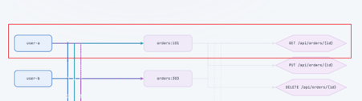

## 4. 판정

### F-10 : 접근 권한 분석

각 접근 조합을 소스별로 정상 허용, 정상 차단, 미검증, 의심 허용, 판단 불가로 판정한다. 신원에는 실제 권한 레벨(ex. User, LV1, LV2, Admin, 테스트 계정)을, 엔드포인트에는 요구 레벨을 부여해 레벨과 엔드포인트와 객체 조합으로 판정하며, 사용자가 레벨을 선택하면 전체 경로 목록은 그대로 둔 채 해당 레벨 기준의 접근 가능 여부 표시만 갱신된다. 사람, 스캐너, LLM이 각각 어떤 경로를 발견하거나 놓쳤는지도 함께 비교한다.

**사용자 흐름**

1. 그래프 구성과 권한 레벨 설정 완료 후 자동 판정
2. 권한 레벨 선택
3. 선택한 권한 레벨 기준으로 전체 경로에서 접근 가능과 접근 불가 표시 확인
4. 메트릭스에서 소스별 발견과 누락, 판정의 차이를 확인
5. 셀 선택 시 근거 확인

| **입력값**                                                       | **출력값**                         |
|------------------------------------------------------------------|------------------------------------|
| 접근 조합(신원, 레벨, 엔드포인트, 객체), 소스별 응답 상태와 본문 | 레벨, 소스별 조합 판정 결과와 근거 |

**조건 및 예외 처리**

- 상태 코드만으로 단정하지 않고 응답 본문을 함께 확인한다. 성공이어도 본문이 비어 확인 불가면 판단 불가로, 404가 권한 거부일 가능성도 함께 고려한다

- 소유자 미확정이면 미검증 유지

- 신원의 실제 권한 레벨은 사용자가 직접 라벨을 지정한다. 테스트 계정 생성 시 이미 알고 있는 값이므로 자동으로 추정하지 않으며, 확인할 수 없으면 Unknown으로 분류한다

- 엔드포인트의 요구 레벨은 관측된 응답 패턴으로 추정한다. 여러 레벨의 신원이 접근을 시도했을 때 성공한 신원 중 가장 낮은 레벨을 요구 레벨로 잠정 확정하고, 근거가 부족하면 미확정으로 둔다

- LLM이 놓친 경로를 사람이 발견한 경우, 사람과 스캐너가 모두 놓쳤으나 LLM이 발견한 경우와 같은 비교들이 매트릭스와 그래프에서 드러나야 한다

**관련 화면**

  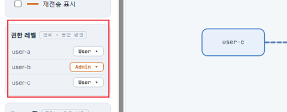

### F-11 : IDOR 분석

객체의 소유자가 아닌 사용자가 타인의 객체에 성공적으로 접근했는지 찾는다. 서로 다른 사용자의 기록이 있어야 성립한다.

**사용자 흐름**

1. 판정 후 자동 검출
2. 의심 목록 확인
3. 근거 요청 확인

| **입력값**                | **출력값**               |
|---------------------------|--------------------------|
| 그래프의 접근과 소유 관계 | 타인 객체 접근 의심 목록 |

**조건 및 예외 처리**

- 사용자가 1명뿐이면 검출 불가 안내

- 소유자 미확정 객체는 제외

- 관리자 권한 접근은 별도 분류

**관련 화면**

  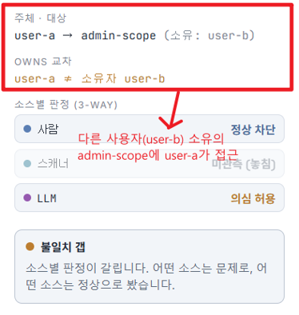

## 5. 커버리지와 갭

### F-12 : 관측 범위 분석

관측된 신원 × 메서드와 엔드포인트 × 객체 조합의 집합을 만든다. 블랙박스 점검이라 전체 조합을 알 수 없으므로 비율(%)이 아니라 관측 조합 수와 갭 개수로 나타낸다.

**사용자 흐름**

1. 판정 후 자동 산출
2. 관측 조합 수와 엔드포인트, 메서드, 객체 수 확인
3. 갭 개수 확인

| **입력값**                     | **출력값**                                         |
|--------------------------------|----------------------------------------------------|
| 그래프(신원, 엔드포인트, 객체) | 관측 조합 집합, 엔드포인트/메서드/객체 수, 갭 개수 |

**조건 및 예외 처리**

- 블랙박스 기반이라서 전체 조합을 알 수 없기 때문에 퍼센트를 쓰지 않는다

- 객체 단위로 계산해 IDOR(객체 소유권) 갭이 드러나게 한다

- 모든 HTTP 메서드(GET, POST, PUT, PATCH, DELETE, OPTIONS 등)를 각각 별개 엔드포인트로 센다

- 갭은 관측된 신원, 엔드포인트, 객체 안에서 계산한다

**관련 화면**

  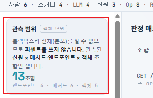

### F-13 : 소스 비교

같은 조합을 세 소스가 각각 찾았는지 비교해, 어떤 소스는 찾고 어떤 소스는 놓쳤는지 드러낸다

**사용자 흐름**

1. 자동 비교
2. 매트릭스에서 소스별 표시 확인
3. 특정 소스만 놓친 셀 확인

| **입력값**              | **출력값**              |
|-------------------------|-------------------------|
| 소스별 관측과 판정 결과 | 소스별 발견/누락 비교표 |

**조건 및 예외 처리**

- 관측한 신원과 객체 중 아직 안 엮은 조합은 미교차

- 일부만 밟은 조합은 어느 소스가 놓쳤는지 표시

- 밟았으나 판정이 갈리면 불일치로 분류

**관련 화면**

  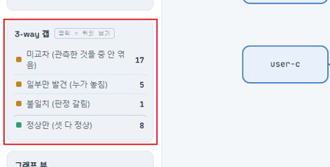

### F-14 : 미교차 조합 검출

이미 관측한 범위 안에서 신원과 객체 중, 아직 서로 엮이지 않은 조합을 찾는다(IDOR 교차 후보).

**사용자 흐름**

1. 자동 검출
2. 목록 확인
3. 위험도 순 정렬
4. 재전송 후보로 넘김

| **입력값**                    | **출력값**                       |
|-------------------------------|----------------------------------|
| 관측된 신원, 엔드포인트, 객체 | 미교차 조합 목록(IDOR 교차 후보) |

**조건 및 예외 처리**

- 아직 시도하지 않은 조합은 접근 불가가 아니라 아직 안 엮음으로 표시

- 그래프에서는 관측이 없어 선이 없던 자리에 점선 후보 엣지로 표시해 실제 관측 엣지와 구분

- 여러 엣지가 겹쳐도 추적하기 쉽게 IDA 그래프처럼 직각으로 꺾이는(orthogonal) 연결선을 쓰고, 선택한 경로만 부각해 강조

- 조합이 과다하면 위험도 상위(타 소유 객체 대상 쓰기 계열 등)만 우선 표시

**관련 화면**

  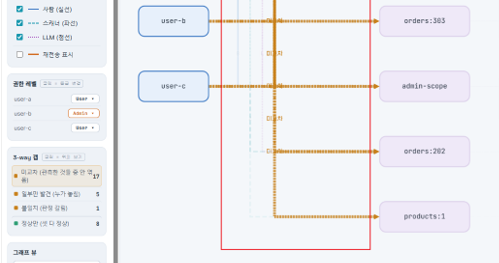

### F-15 : 불일치 갭 검출

같은 조합에 대해 사람, 스캐너, LLM의 판정이 서로 다른 경우를 찾는다.

**사용자 흐름**

1. 자동 검출
2. 매트릭스 강조 확인
3. 셀 선택 시 소스별 판단과 근거 비교

| **입력값**       | **출력값**       |
|------------------|------------------|
| 소스별 판정 결과 | 불일치 조합 목록 |

**조건 및 예외 처리**

- 한 소스에만 기록이 있으면 불일치가 아니라 미교차

- 어느 소스가 어떻게 달랐는지 함께 표시

- 갭 종류(미교차, 일부만 발견, 불일치)와 정상만(세 소스 모두 정상) 선택 시 매트릭스와 그래프에서 해당 항목만 강조

- 정상만 필터로 이상 없는 조합을 걸러내 검토 대상을 좁힐 수 있어야 함

**관련 화면**

  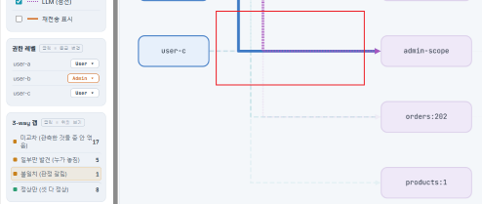

  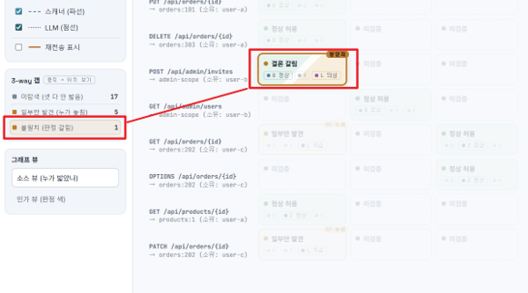

## 6. 시나리오 제안

### F-16 : 규칙 기반 분석

사람, 스캐너, LLM 관측을 종합한 결과물로 시나리오 제안용 입력을 만든다.

**사용자 흐름**

1. 사용자가 제안 요청
2. 규칙 기반으로 종합 요약 생성 (LLM 미사용)
3. 전송 전 내용 확인

| **입력값**               | **출력값**     |
|--------------------------|----------------|
| 세 소스의 갭과 판정 결과 | 종합 요약 정보 |

**조건 및 예외 처리**

- 인증 정보와 개인정보는 제거 후 요약

- 전송 전 사용자가 내용을 확인할 수 있어야 함

- 시나리오 제안용 입력 생성은 규칙 기반으로 동작한다. (LLM 사용 X)

**관련 화면**

  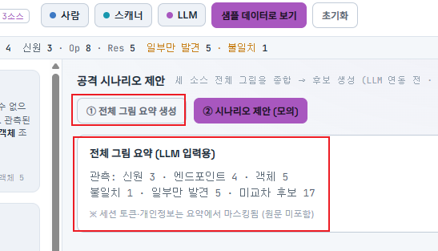

### F-17 : AI 분석

시나리오 제안용 입력을 바탕으로 아직 시도되지 않은 새로운 공격 시나리오를 LLM에게 제안받는다.

**사용자 흐름**

1. 요약 전송
2. LLM에게서 시나리오 수신
3. 근거 갭 확인
4. 재전송으로 넘길지 선택

| **입력값**     | **출력값**                          |
|----------------|-------------------------------------|
| 종합 요약 정보 | 시나리오 후보 목록(대상 조합, 근거) |

**조건 및 예외 처리**

- 제안은 후보이며 자동 실행하지 않고, 사용자가 승인한 경우에만 재전송과 검증(F-18~F-19)으로 넘어감

- 근거 갭이 없는 제안은 채택 대상에서 제외

- 응답 실패 시 갭 목록만으로 진행 가능

**관련 화면**

  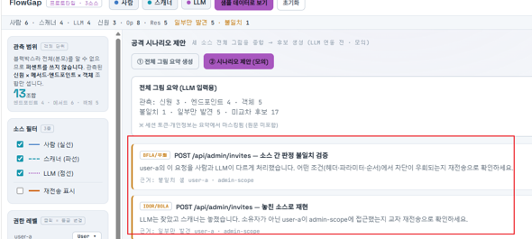

## 7. 재전송(검증)

### F-18 : 요청 검증

그래프 노드를 클릭해 해당 API의 요청을 파라미터와 값 변조 후 다시 보낸다. Burp Extension을 통해 실시간으로 request와 response를 주고받는다.

**사용자 흐름**

1. 노드 선택
2. 요청 상세 확인
3. 파라미터, 값, 메서드 변조
4. 스코프로 허용 범위 확인 후 전송
5. 응답 확인

| **입력값**                             | **출력값**                       |
|----------------------------------------|----------------------------------|
| 선택한 노드의 원요청, 사용자 변조 입력 | 재전송 요청과 응답 (재전송 표식) |

**조건 및 예외 처리**

- 메서드별 입력 위치를 구분해 변조 대상을 제시한다(GET, HEAD는 쿼리와 경로 / POST, PUT, PATCH는 본문 / DELETE, OPTIONS는 경로)

- 스코프 밖 대상으로는 전송 차단

- 상태를 바꾸는 요청(PATCH, DELETE 등)은 별도 경고 후 진행

- 결과는 관측 주체인 사람, 스캐너, LLM과 섞지 않고 재전송으로 분리하여 기록

- 원요청과 변조 요청을 나란히 비교 표시

**관련 화면**

  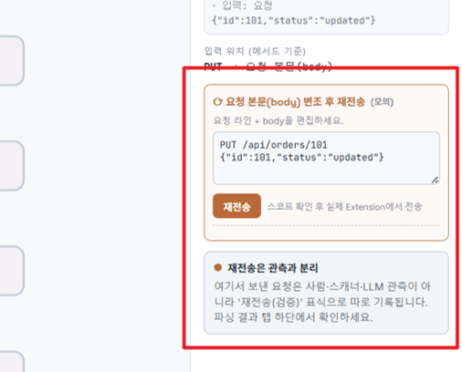

### F-19 : 결과 검증

재전송으로 주고받은 요청과 응답을 사람, 스캐너, LLM관측 소스와 분리된 재전송 영역에서 확인한다.

**사용자 흐름**

1. 재전송 기록 진입
2. 원요청과 결과 비교
3. 판정 반영 여부 선택

| **입력값**              | **출력값**                    |
|-------------------------|-------------------------------|
| 재전송 요청과 응답 기록 | 재전송 목록, 원요청 대비 변화 |

**조건 및 예외 처리**

- 재전송으로 확인된 사실은 추정과 구분해 표시

- 판정에 반영할지는 사용자가 선택

- 결과가 불명확하면 기존 판정 유지

**관련 화면**

  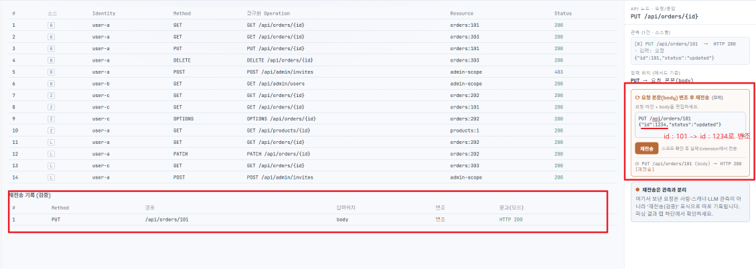

## 8. 시각화

### F-20 : Flow Graph

세 소스의 관계망을 한 화면에 그래프로 표시한다.

**사용자 흐름**

1. 그래프 화면 진입
2. 확대와 이동
3. 노드나 연결선 선택
4. 상세 확인

| **입력값**                  | **출력값**           |
|-----------------------------|----------------------|
| 소스가 구별된 플로우 그래프 | 화면에 표시된 그래프 |

**조건 및 예외 처리**

- 개별 요청이 아닌 정규화 단위로 표시해 항목 수 억제

- 항목이 많으면 접어서 표시하고 선택 시 펼침

- 연결선은 곡선이 아니라 직각으로 꺾이는(orthogonal) 형태로 그려, 여러 선이 교차해도 시작 노드와 도착 노드를 추적하기 쉽게 하고 선택한 경로만 부각

- 데이터 없으면 안내 문구 표시

**관련 화면**

  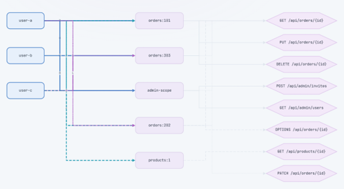

### F-21 : 그래프 필터 

선택에 따라 사람, 스캐너, LLM 중 원하는 소스의 그래프만 보거나 겹쳐 본다.

**사용자 흐름**

1. 소스 필터 선택(사람/스캐너/LLM/겹쳐보기)
2. 해당 소스만 표시
3. 조합 전환

| **입력값**                      | **출력값**           |
|---------------------------------|----------------------|
| 소스가 구별된 그래프, 필터 선택 | 필터가 적용된 그래프 |

**조건 및 예외 처리**

- 여러 소스 동시 선택 가능

- 필터 중에도 소스별 디자인 구별 유지

- 재전송 표식은 별도 토글로 표시/숨김

**관련 화면**

  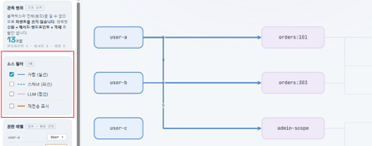

### F-22 : 상세 분석 

노드를 클릭하면 해당 API의 요청과 응답을 관찰한다(메서드, 파라미터, 본문, 상태 코드 등).

**사용자 흐름**

1. 노드 선택
2. 요청 상세(메서드, 경로, 파라미터, 본문) 확인
3. 응답(상태, 본문) 확인
4. 재전송으로 이동 가능

| **입력값**  | **출력값**                    |
|-------------|-------------------------------|
| 선택한 노드 | 요청과 응답 상세, 소스별 판정 |

**조건 및 예외 처리**

- 메서드에 따라 입력 위치를 함께 표시(GET, HEAD는 쿼리와 경로 / POST, PUT, PATCH는 본문 / DELETE, OPTIONS는 경로)

- 인증 정보는 가린 상태로 표시

- 여러 관측(소스별, 복수 요청)이 있으면 목록으로 제공

- 상세 화면에서 바로 재전송(F-18)으로 연결

**관련 화면**

  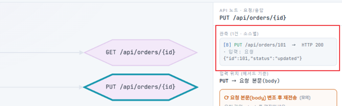

### F-23 : 권한 분석

사용자와 접근 대상 조합을 표로 배치하고 소스별 판정과 불일치를 표시한다.

**사용자 흐름**

1. 매트릭스 진입
2. 셀의 소스별 판정 확인
3. 갭과 불일치만 보기 선택
4. 셀 선택 시 근거 확인

| **입력값**                  | **출력값**    |
|-----------------------------|---------------|
| 소스별 판정과 커버리지 결과 | 매트릭스 화면 |

**조건 및 예외 처리**

- 기록 없는 칸은 미검증

- 셀 안에 세 소스의 판정을 함께 표시

- 갭 종류(미교차, 일부만 발견, 불일치)를 선택하면 해당 셀만 강조해 위치를 한눈에 볼 수 있어야 함

- 불일치 항목을 우선 강조

**관련 화면**

  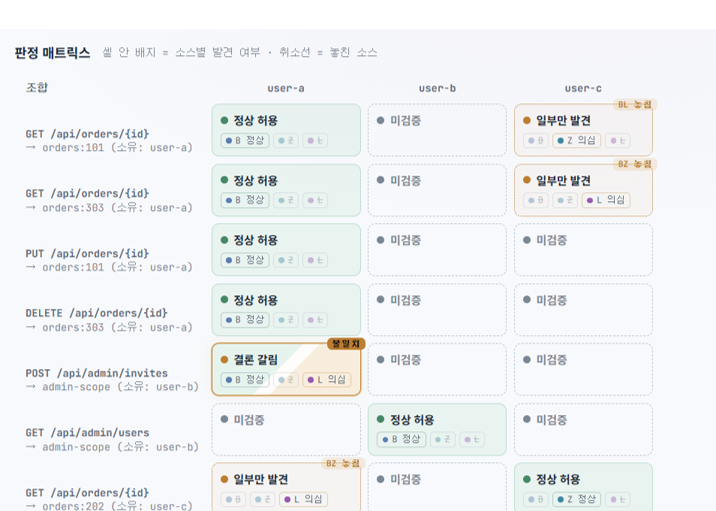

### F-24 : 판정 근거

선택한 항목의 실제 요청 기록과 소스별 판정 사유를 표시한다.

**사용자 흐름**

1. 노드, 연결선, 셀 선택
2. 근거 패널 확인
3. 원본 요청 확인

| **입력값**  | **출력값**                      |
|-------------|---------------------------------|
| 선택한 항목 | 요청 목록, 소스별 판정, 갭 유형 |

**조건 및 예외 처리**

- 추정과 확인된 사실을 구분해 표시

- 재전송으로 확인된 항목은 그 사실을 명시

**관련 화면**

  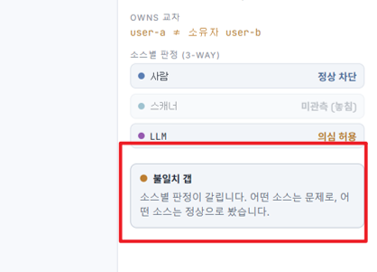

