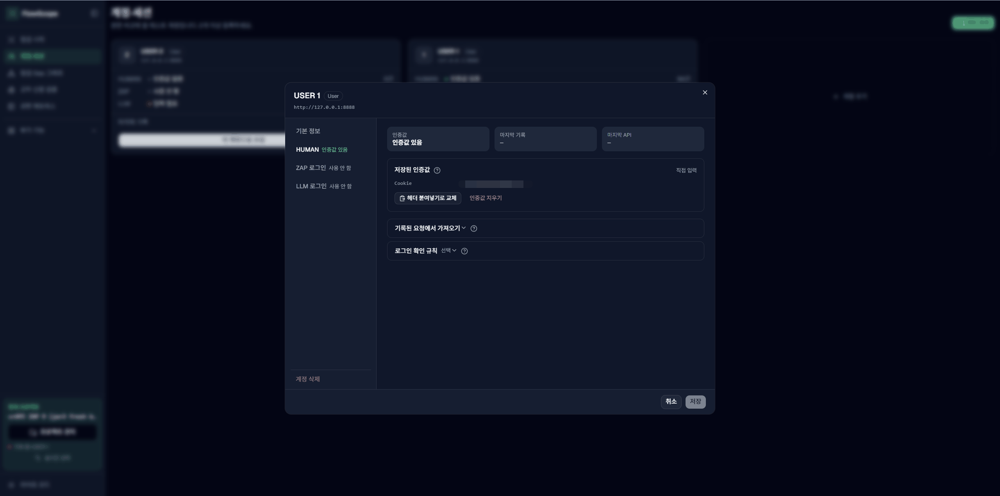
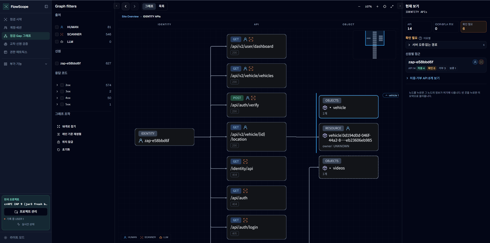
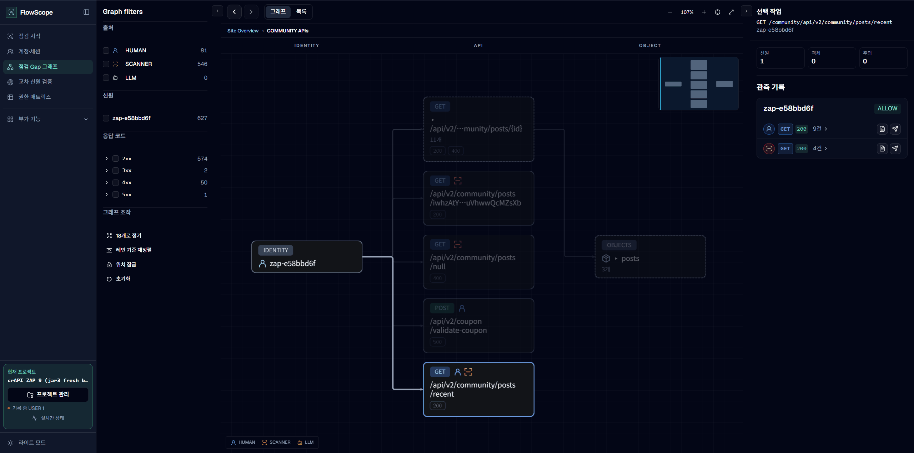
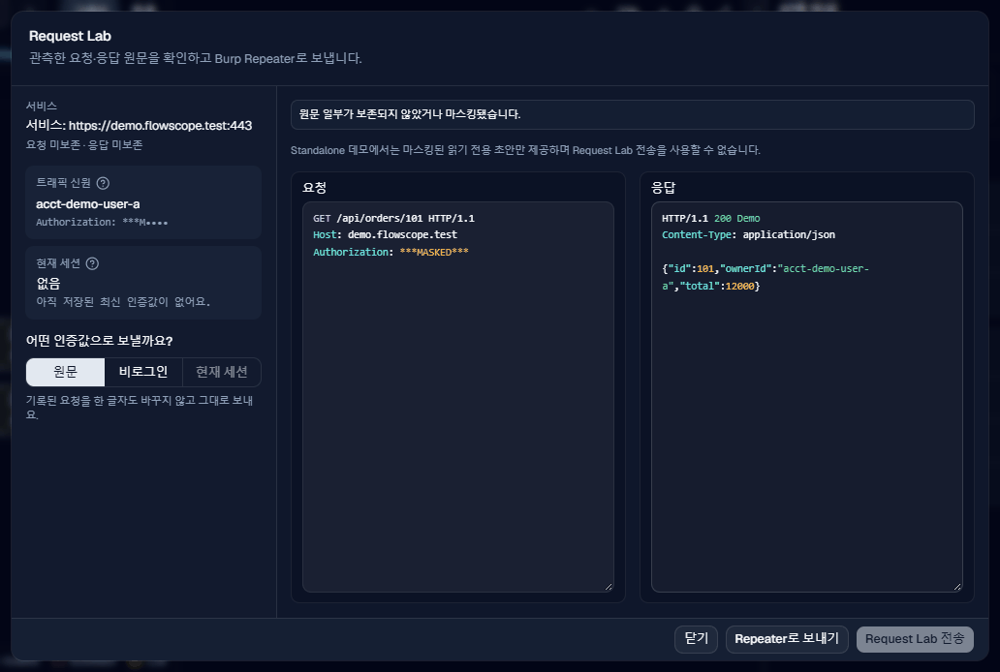

# 화면별 설명

## 요약

| 화면 | 하는 일 |
|---|---|
| Burp **FlowScope** 탭 | 웹 화면을 열거나 주소를 복사합니다. 접혀 있는 **프로젝트 도구**에서 샘플 프로젝트, Proxy 기록 가져오기, 프로젝트 열기, 로컬 DB 저장, JSON 내보내기를 하고 현재 점검 범위를 봅니다. 점검 범위는 웹 화면의 프로젝트 관리에서 정합니다 |
| 대시보드 | 지금까지 모은 요청 수, 아직 확인하지 않은 곳(Gap), 의심 후보를 한 화면에 요약합니다 |
| 점검 시작 | 수집 기록, ZAP 스캔, LLM 탐색, 결과 비교 탭에서 수집한 요청을 보고 ZAP 스캔과 LLM 탐색을 실행합니다 |
| 계정·세션 | 테스트 계정을 등록하고, 계정 카드에서 직접 둘러보기를 시작·일시 정지·종료합니다. 비로그인 자동 검증을 켜고 끄며 로그인 상태와 ZAP 로그인 설정을 관리합니다 |
| 점검 Gap 그래프 | 사이트, API 묶음, API, 데이터 순서로 내려가며 누가 어디에 접근했는지 봅니다 |
| 부가 기능 → 교차 신원 검증 | 모은 요청을 다른 계정이나 비로그인으로 다시 보내 결과를 비교합니다. 로그인 세션이 확인된 계정만 고를 수 있습니다 |
| 권한 매트릭스 | 계정별로 기능과 데이터에 접근한 결과를 표로 보고 최종 판정을 남깁니다 |
| 부가 기능 → API·입력 차이 | 문서나 코드에 적힌 API와 실제로 오간 API를 비교합니다 |
| 취약점 시나리오 (`#scenarios`, 주소로 열기) | 규칙으로 찾은 IDOR, BFLA 후보를 하나씩 검토합니다 |
| 부가 기능 → 관측 기록 | 실제로 오간 요청과 응답 원본을 봅니다 |
| 실행 상태 (`#runs`, 주소로 열기) | 직접 둘러보기, ZAP, LLM 탐색의 현재 상태와 지난 실행 기록을 봅니다 |
| 프로젝트 관리 (사이드바 아래) | 프로젝트를 만들거나 열고, 점검 범위를 고치고, 기록을 비웁니다 |
| 실시간 상태 (사이드바 아래) | 점검 범위, 수집, ZAP 연결 상태를 봅니다 |

처음 설치한다면 [README](../../README.md)부터 보세요.

## 계정의 HUMAN 인증값 관리

**계정·세션**에서 해당 계정의 **관리**를 누르고 **HUMAN**을 엽니다. 저장된 인증값이 있으면 헤더 이름과 앞 몇 글자만 보이고, **헤더 붙여넣기로 교체**로 바꿀 수 있습니다. 아직 없으면 점검에서 이 계정으로 둘러볼 때 자동으로 채워지며, **헤더 붙여넣기로 입력**으로 직접 넣을 수도 있습니다. **기록된 요청에서 가져오기**를 펼치면 Burp에 기록된 요청을 골라 이 계정에 연결할 수 있습니다. 필요한 경우 **로그인 확인 규칙**에 검증할 요청 경로와 응답 표식을 정합니다.

계정 등록과 로그인 연결은 별개입니다. 계정 이름과 역할만 등록했다고 인증값이 준비되는 것은 아닙니다. 인증값의 존재와 그 값을 어떤 근거로 확인했는지도 구분해야 합니다. 다른 계정으로 다시 보내기 전에는 연결된 계정과 세션 상태를 확인하세요.

## 그래프에서 기록 확인하기

아래는 Burp 없이 띄운 연습용 샘플 데이터 화면입니다. 그래프의 신원과 요청을 보낸 출처는 서로 다릅니다. 같은 신원에 HUMAN, SCANNER, LLM 요청이 함께 연결될 수 있습니다.

**미확인 신원**은 등록 계정이나 비로그인 상태에 연결되지 않은 인증값으로 보낸 요청입니다. 점검 시작 전에 로그인한 요청이 대표적인 예입니다. 이런 요청은 판정에 쓰지 않으므로, **핵심 API만** 보기에는 신원 카드가 나오지 않고 **관측 전체**에서만 나옵니다.

### API와 객체 보기

API 그룹에 들어가면 왼쪽에는 신원, 가운데에는 API, 오른쪽에는 객체가 나옵니다. 객체 묶음을 펼치면 개별 ID와 소유자를 볼 수 있습니다. 아래에서 `orders:101`의 소유자는 `acct-demo-user-a`인데 `acct-demo-user-b`도 이 주문에 접근했습니다. 그래서 오른쪽 패널에 IDOR 후보로 올라와 있습니다. 소유자를 확인하지 못한 객체는 `owner: UNKNOWN`으로 나오며, 먼저 접근한 계정의 것이라고 단정하지 않습니다.

그래프 아래 범례와 왼쪽 **필터**의 HUMAN, SCANNER, LLM은 요청을 보낸 출처입니다. API 카드 옆 아이콘도 출처를 표시합니다. 응답 코드 `200`은 그 요청의 응답 결과이지 취약점 판정이 아닙니다.

### 선택한 API의 관측 기록 보기

API 노드를 누르면 오른쪽에 **선택 작업**과 **관측 기록**이 나타납니다. 아래는 `GET /api/orders/{id}`를 고른 예입니다. 계정마다 HUMAN, SCANNER, LLM이 남긴 기록이 응답 코드별로 묶여 나옵니다. `acct-demo-user-b`는 다른 계정의 주문(`orders:101`)에 접근한 기록이 있어서 SUSPICIOUS로 표시됩니다.

기록 오른쪽의 문서 아이콘은 **원문 보기**, 종이비행기 아이콘은 **현재 세션으로 Repeater**입니다. 원문 보기에서 실제 요청과 응답을 확인하고, 직접 다시 보내 볼 때는 Repeater 초안으로 엽니다. 세션이 준비되지 않았다면 먼저 계정 연결이 필요합니다. 화면의 `ALLOW`나 `200`만 보고 누구에게나 허용해야 하는 API인지, 취약점인지 판단하지 마세요.

## 요청 실험실에서 확인하고 다시 보내기

그래프의 관측 기록에서 **원문 보기**를 누르면 아래 Request Lab(요청 실험실)이 열립니다. 요청과 응답을 나란히 보고, 왼쪽에서 요청 당시의 **트래픽 신원**과 **현재 세션**을 비교합니다.

**원문**, **비로그인**, **현재 세션** 중 다시 보낼 때 사용할 인증값을 고릅니다. **Repeater로 보내기**는 Burp에 초안을 열고, **Request Lab 전송**은 점검 대상에 실제 요청을 보냅니다. 보기만 해서는 전송되지 않습니다. 현재 세션이 없으면 그 선택은 사용할 수 없습니다.

이 화면은 HUMAN 작업 피드의 읽기 전용 **원문 보기**와 다릅니다. 피드에서는 요청과 응답만 확인하고, 여기서는 조건을 바꿔 직접 검증할 수 있습니다. 현재 프로세스 메모리에 원문이 없으면 마스킹된 내용만 볼 수 있으며 편집이나 전송이 제한될 수 있습니다. 직접 전송한 결과는 탐색 기록과 구분되는 검증 기록으로 남습니다.

## 자세한 내용

### 제품 작업면

beta.47에서 수정한 ZAP 종료·재시작 경합 처리는 지금도 유지됩니다. ZAP 실행 화면의 `종료 처리 · 임시 상태 정리 중` 동안에는 이전 실행을 정리하므로 시작·중복 취소 버튼이 잠깁니다. 최종 완료·실패·취소가 표시되면 다음 실행을 시작할 수 있습니다.

요청 비교는 분석하지 못한 본문과 UNKNOWN metadata를 불확실한 상태로 남깁니다. 모든 Evidence 작업면의 선택·검토 메모·Request Lab 초안은 해당 프로젝트와 서버 Evidence에 묶입니다. 일시 snapshot 실패는 마지막 성공 데이터와 열린 초안을 유지하면서 새 선택·편집·전송을 잠그고, 실패 전에 시작한 전송은 취소하지 않아 서버 Evidence와 화면 결과가 갈리지 않게 합니다. 새 진단·프로젝트·샘플 전환은 현재 진단 저장이 성공해야 적용됩니다(D-147, D-151).

`http://127.0.0.1:17777/`와 `/app/`는 동일한 React 작업면을 제공하고 `/legacy/`는 전환 기간의 기존 작업면을 제공합니다. 첫 진입은 `API·입력 차이`이며, React가 분석기나 판정 상태 기계를 대체하지 않고 같은 localhost API snapshot을 표시합니다.

- **Burp 탭** — 강조된 Web UI 열기·주소 복사, 기본 접힌 프로젝트 도구(Proxy history 가져오기, 로컬 SQLite DB 저장·연결/불러오기, JSON 내보내기, 샘플, 읽기 전용 범위·수집 요약). 새 프로젝트 생성과 범위 설정은 Web UI에서 수행
- **Web 사이드바 탐색** — 핵심 화면 `점검 시작 / 계정·세션 / 점검 Gap 그래프 / 권한 매트릭스`는 독립 링크로, `API·입력 차이 / 교차 신원 검증 / 관측 기록`은 `부가기능` 드롭다운으로 제공합니다. 취약점 시나리오와 실행 상태는 사이드바 메뉴에 표시하지 않습니다. 화면에서는 이 문서의 Evidence(실제로 관측한 요청·응답 기록)를 **관측 기록**, Evidence ID를 **기록 번호**로 표시합니다. 데스크톱 사이드바는 로고 옆 패널 버튼 또는 ⌘B/Ctrl+B로만 펼치고 접으며(커서를 올려도 펼쳐지지 않음), 펼치면 본문을 덮지 않고 옆으로 밀어내고 마지막 상태를 브라우저에 기억합니다. 접힌 아이콘은 마우스를 올리면 메뉴 이름을 보여 주며, 좁은 화면은 햄버거 메뉴를 씁니다. 상단 상태 표시줄은 없으며, 범위·HUMAN·ZAP·SCANNER 상태는 사이드바 프로젝트 블록의 **실시간 상태** popover에서 확인합니다. 기본 진입과 FlowScope 로고는 Home(대시보드 본문 포함)이며 `#dashboard`·`#sequence`는 주소로 열고, `#parameter-map` 옛 북마크는 통합 `#graph`로 이동합니다. 현재 프로젝트 이름과 **프로젝트 관리**는 사이드바 맨 아래에 있으며(저장 실패만 빨간색으로 표시), 프로젝트명과 scope는 Web UI의 프로젝트 관리 창에서 정합니다.
- **그래프** — `#graph`는 **전체 관계 보기**(Site→API 그룹→API→Object 계층)로 먼저 열립니다. **점검 우선순위** 탭은 서버가 만든 Gap(source/계정/조건/타입 미관측, 선언 미관측, 권한 변형 미검증)을 우선순위 사유 순 큐와 조건/사용자→API→입력→권한 대상 카드 경로로 보여 줍니다. 데스크톱의 큐·분석 필터·선택 상세는 경계 레일에 커서를 두어 접거나 열고 너비를 조절할 수 있으며, 접어도 현재 그래프 선택은 유지됩니다. 점검 큐를 접으면 GAP 제목·필터·상태·진단도 함께 접혀 그래프 공간이 늘어납니다. 점검 우선순위 그래프도 관계 그래프와 같이 트랙패드 두 손가락 스크롤은 이동, 핀치·마우스 휠은 확대/축소입니다. 주체·선 범례와 UNKNOWN/INFERRED 설명은 헤더의 `?`(범례·도움말) 아이콘에 두며, 커서를 올리거나 포커스하면 펼쳐지고 벗어나거나 Esc를 누르면 닫힙니다(터치는 탭으로 열고 닫음). 카드 경로의 엣지는 라벨 없이 Gap(주황 파선)과 그 밖의 관계(회색 실선·점선)로만 나누고, API·권한 대상 카드의 배지 옆에 실제 요청한 주체 아이콘을 표시합니다. 모든 카드는 배지와 제목만 둔 같은 크기이며(한 줄 제목은 세로 가운데), 역할·Gap 종류·owner·관측 수·값 형태·HTTP 결과·신뢰도는 카드에 커서를 올리면 나오는 설명과 키보드 경로 목록에 남깁니다. Gap은 점검 후보이며 취약점 판정이나 퍼센트가 아닙니다.
- 입력과 접근 대상의 단일 동시출현은 관계 근거일 뿐 확인된 인가 경계가 아닙니다. `CONFIRMED_AUTH_BOUNDARY`는 확정 소유자가 있는 리소스를 정확한 입력 값이 참조하거나, 공개된 독립 요청 2건에서 같은 리소스와 함께 관측된 경우에 사용하며(D-154), 그 외 연결은 사람 검토 대상으로 남깁니다.
- **API·입력 차이** — 선언과 실제 관측을 endpoint/parameter 단위로 대조하고 source별 Evidence ID와 provenance를 연다. 실제 관측 행의 **관측 기록 상세**에서 Request Lab과 Burp Repeater 초안으로 바로 이어지며, 선언만 있고 요청이 없는 항목에는 전송 가능한 Evidence가 있는 것처럼 버튼을 만들지 않습니다. 비교 표 헤더의 `필터`와 `집계`에서 출처·비교 상태 및 산출물·부분 파싱 건수를 확인하며, 실행 요약은 `실행 상태`에서 확인합니다. 선언만 있는 행은 관측 `0`과 HTTP `—`로 표시하며, 블랙박스 전체 퍼센트나 취약점 판정은 만들지 않음
- **화면별 분석 제어** — 수집·메인 비교·기본 숨김·검토 대기 수량과 HUMAN/SCANNER/LLM, Evidence 처분·class, 역할 정책·3-way gap 필터는 각 작업면의 context panel에서 제공하며 전역 route 탐색과 섞지 않습니다.
- **인가 그래프** — 세 단계 계층으로 읽습니다. **Site Overview**는 Target→API 그룹(첫 안정 경로 세그먼트, 예 `ORDERS APIs`) 카드에 API 수·H/S/L Evidence 수·Gap·경로 후보 수를 표시하고, 그룹을 열면 신원→API를 suspicious·충돌·일부 관측·Evidence 수 순으로 18개씩 보여 주며, API를 열면 신원→API→접근 대상 ID를 18개씩 보여 줍니다(`API/Object 18개 더 보기 (N개 남음)`). 현재 위치는 `Site Overview › API 그룹 › METHOD /path` breadcrumb로 표시하고 상위 항목을 선택해 이동합니다. 상세 경로는 host를 반복하지 않습니다. 관측 엣지는 라벨 없는 한 가지 선으로 그리고 오른쪽 API·Object 카드의 METHOD 배지 옆에 접근한 주체만 아이콘(HUMAN 사람 / SCANNER 스캐너 / LLM 로봇)으로 표시하며, API 카드 제목은 그룹 이름(예 `WORKSHOP APIs`) 구간까지를 생략한 경로를 `/` 경계로 최대 두 줄 표시하고 두 줄로도 넘치면 앞쪽을 `…`로 줄여 끝부분을 남기며(전체 경로는 커서를 올리면 표시), 관측과 분리된 미요청 route 후보, 별도 인가 판정 view, 미교차 후보 상세(GAP 목록), 화면 맞춤을 제공합니다. 노드는 기본 회색이며 판정 매트릭스의 위험 항목을 사용자가 확정한 경우만 빨간 테두리로 표시합니다. 데스크톱은 배경 드래그로 이동하고, 자동 입력 모드에서 트랙패드 두 손가락 스크롤은 이동·마우스 휠은 확대/축소로 처리하며 오인식 시 트랙패드/마우스 모드를 직접 고를 수 있습니다. 이동·확대/축소는 화면 변환만 수행하므로 노드를 옮겨 둔 자리는 그대로 남고, 레인 경계는 노드와 같은 좌표계에서 함께 움직입니다. 노드는 자기 레인 안에서 원하는 자리에 둘 수 있고 그 위치가 저장됩니다. 레인의 범위는 그 레인 노드들이 차지한 영역으로 정해지므로 노드를 바깥으로 끌면 범위가 함께 넓어지고, 이웃 레인 노드를 넘어설 수는 없습니다. 레인 머리글은 이 범위를 따라 움직이며 머리글을 누르면 그 레인만 다시 정렬하고, 전체를 되돌리려면 `레인 기준 재정렬`을 누릅니다. 노드 오른쪽 아래 모서리에 커서를 대면 커서가 크기 조절 모양으로 바뀌며, 누른 채 끌어 카드를 기본 크기부터 두 배까지 키울 수 있습니다(좌상단 고정, 오른쪽 이웃 레인 직전에서 멈춤, 키우면 제목 줄이 늘어남). 키보드는 노드 포커스 후 `Shift+방향키`로 조절합니다. 바꾼 크기는 새로고침해도 유지되고, `레인 기준 재정렬`(전체)이나 레인 머리글 정렬(그 레인)을 누를 때만 기본 크기로 돌아가며, 위치 잠금 중에는 조절할 수 없습니다. 레인 경계의 조절 손잡이를 끌거나 키보드 좌우 방향키(`Home`은 기본 폭)로 각 레인 폭을 바꿀 수 있고, 폭은 계층의 레인 수별로 저장됩니다. 900px 이하와 `API 목록 보기`는 중복 Source Evidence 경로 없이 같은 계층 카드와 상세 선택을 제공합니다. 캔버스 카드에는 판정 글자를 쓰지 않고, 목록 보기·접근 이름에서 선택한 서버 셀이 모두 같을 때만 노드 판정을 표시하며 여러 셀이 겹치면 상세에서 원본 셀을 각각 보여 줍니다. 사용자가 확정한 위험 노드는 빨간 테두리로 구분합니다. HTTP 상태는 관측 outcome일 뿐 인가 판정으로 승격하지 않으며 응답→요청 데이터 의존성은 `흐름 순서`에서 따로 표시합니다.
- **판정 매트릭스** — 기본 탭은 정책 P·실행 E·소유권 O를 합산하지 않고 나란히 두는 판정 매트릭스입니다. BFLA(역할 × 기능)·BOLA/IDOR(계정 × 객체)·실행 Evidence 보기에서 셀마다 기대(허용/차단/미정)→실제(성공/차단/갈림/해석 불가/미실행), P/E/O 등급, 상태를 보여 주며 오른쪽 상세는 모든 셀에서 같은 세 칸 — **역할·정책 지정**(필수 역할·신원 역할·객체 정책(소유자 전용·같은 역할 공유·인증 사용자 공유·공개·관리자 전용·미정), 현재 값 미리 채움), **Burp Repeater 전송**(추천 여부와 무관하게 모든 셀을 대상 신원 자격의 초안으로 열며 자동 전송 없음), **사람 최종 판정**(검토 대상이 아닌 셀은 잠김) — 으로 구성합니다. 기능·객체 열은 고정하지 않고, 경로를 `/` 경계로 최대 두 줄(20rem 블록) 표시하며 넘치면 앞쪽을 `…`로 줄이고 전체 경로는 커서를 올리면 보입니다. 보기 전환 탭(판정 매트릭스·파라미터 커버리지·기존 권한 매트릭스)은 그래프 화면처럼 각 보기의 상단 줄에 두고, 왼쪽 패널은 가운데 정렬한 `BFLA`/`BOLA/IDOR` 두 알약 버튼(축 설명은 마우스 설명)과 `주의 항목만` 스위치만 둡니다. 테넌트 축은 사용하지 않습니다. 후보 여부는 서버 권한 셀만 따르고 2xx만으로 승격하지 않습니다. Web 판정 상세의 안전 자동 재전송(런 1회 승인)은 제거했고, 강검증 `ACTIVE` 신원으로의 자동 재전송은 `교차 신원 검증` 화면에서 제공합니다. 결과는 기존 판정기에 후보 근거로만 들어가며 사람이 확인하기 전에는 취약점으로 확정하지 않습니다. 둘째 탭 **파라미터 커버리지**는 URL origin을 숨긴 Method·API 카드와 상태 버튼으로 서버의 입력×권한 대상×subject×source 검증 좌표를 표시하고, 전체 좌표 근거는 선택 상세에서 보여 줍니다. 셋째 탭 **기존 권한 매트릭스**는 `identity/role × operation × resource` cell을 H/S/L 탐지 여부로 압축하고, 접기·너비 조절이 가능한 필터/상세 사이에서 표만 스크롤합니다. 사람 판정은 저장 당시의 신원 역할·필수 역할·소유자를 함께 기록하고, 그중 하나가 바뀌면 기록은 지우지 않은 채 `미확정`(재검토 필요)으로 되돌립니다.
- **라이브 교차 신원 재전송** — 런 1회 승인을 받은 동안 사용자가 선택한 HUMAN·ZAP·LLM 탐색 요청을 선택한 다른 강검증(운영자 확인·규칙 확인) `ACTIVE` 등록 계정과 선택적 비로그인 문맥으로 재전송합니다. 약검증(`LEGACY_RESPONSE`) 계정은 프론트·백엔드 모두에서 재전송 선택이 거부됩니다. HUMAN은 관측 트래픽, ZAP·LLM은 각자의 통제된 탐색 Evidence만 기준으로 허용하며 로그인·검증·재전송 결과를 다시 입력으로 사용하지 않아 반복 루프를 막습니다. 기준 요청의 계정은 자동 제외하며, 현재 프로세스에 원문 요청이 남아 있고 분류 결과가 `API/INCLUDE`인 새 Evidence만 사용합니다. `GET/HEAD`만 자동 전송하고 `POST/PUT/PATCH/DELETE`는 Repeater 초안만 생성합니다. 런당 대상 조합은 200건으로 제한하며 중지·프로젝트 전환·확장 unload 시 이후 전송을 차단합니다. 응답은 `SCANNER + AUTHORIZATION_REPLAY + CONTROLLED` Evidence로 기존 판정기에 들어갈 뿐 자동 확정되지 않습니다. UI는 별도 작업이며 API는 `start-live`의 `sources=HUMAN,ZAP,LLM`, `stop-live`, 상태 조회를 제공합니다.
- 판정 매트릭스의 계정·기능·접근 대상 조합은 서비스 경계 안에서만 생성합니다. 등록 계정은 `AccountProfile.service`, 익명·미등록 관측 신원은 실제 Evidence의 서비스 범위만 사용합니다. 등록 계정의 설정 서비스가 현재 관측·정책 작업과 하나도 맞지 않으면 계정을 조합에 섞지 않고 설정 확인 경고에 계정과 서비스를 표시합니다.
- **흐름 순서** — timestamp가 있는 관측에서 복원한 응답→요청 ID/token 의존성
- **시나리오** — 현재 결정론적 BOLA/BFLA 규칙 후보와 사람 검토. 이전 LLM 평가·판정은 별도 읽기 전용 기록
- **시나리오 감사·오버라이드** — Evidence-bound 상태와 마스킹 note를 갖는 사람 감사면. 자동 LLM 판정이 아님
- **Evidence** — 마스킹된 source, identity, method, 정규화 operation, resource, status, traffic class/disposition, repeat count, stable Evidence ID. 행을 선택하면 같은 operation의 마스킹 Request/Response와 payload 보존 상태를 200건씩 페이지로 확인합니다. live 원문은 사용자가 Request Lab을 열 때 해당 Evidence 하나만 메모리로 가져옵니다.
- **점검 시작 수집 기록** — Human·ZAP·LLM·비로그인 자동 검증 요청을 한 목록에 모으고 `전체/Human/ZAP/LLM/비로그인 자동 검증` 필터로 나눕니다. 높이가 제한된 목록에서 기록 번호·메서드·경로·계정·HTTP 상태를 즉시 검색하고 접거나 펼칠 수 있습니다. 요청 행의 **원문 보기**는 선택한 Evidence 하나의 마스킹 요청·응답을 클릭 시에만 메모리로 불러와 읽기 전용으로 표시하며, 닫기·프로젝트 교체·페이지 종료 시 즉시 비웁니다. 이 확인 창에서는 편집·자격 전환·Repeater·Request Lab 전송을 제공하지 않습니다.
- **계정·세션** — 상단 **계정 등록**과 계정별 **관리**가 일관된 오른쪽 창으로 이어집니다. 등록 창은 기본 정보와 같은 exact-origin의 관측 신원 연결을 구분하고, 생성 후 기존 기본 정보·HUMAN·ZAP 로그인 탭으로 계속 진행합니다(LLM 탐색 계정은 점검 시작의 LLM 탐색 단계에서 브라우저 로그인으로 연결합니다). 생성과 신원 연결은 기존 API로 각각 처리되며 일부만 성공하면 그 상태를 그대로 알립니다. 메인 목록은 비로그인 카드와 계정 카드로 역할·대상 서비스와 HUMAN·ZAP·LLM 연결 상태를 요약하고, 카드의 **시작 / 일시 정지 / 종료 / 수집 보기**로 직접 둘러보기를 다룹니다. 목록 위의 **비로그인 자동 검증** 스위치는 계정으로 방문한 GET API를 비로그인으로 한 번씩 다시 보내며 비로그인 응답·대기·실패 건수를 보여 줍니다. 로그인 ID·비밀번호·Cookie·Authorization은 화면 API·snapshot·프로젝트에 반환하거나 저장하지 않고 존재 여부만 표시합니다.
- **오른쪽 선택 상세** — 점검 우선순위의 Gap 상세와 전체 관계 보기의 선택 상세는 선택 좌표에 연결된 실제 Evidence 목록만 보여 줍니다. 행마다 `원문 보기`(필요할 때만 가져오는 마스킹 Request/Response, Request Lab)와 `현재 세션으로 Repeater`(관측 신원의 재사용 가능한 ACTIVE 세션으로 Burp Repeater 초안을 엶, 자동 전송 없음)를 둡니다. 현재 세션이 없으면 Repeater를 열지 않고 원문 보기에서 계정을 고르도록 안내합니다. 원문은 요청하는 동안만 메모리에서 다루며 쿼리 캐시·snapshot·프로젝트에는 넣지 않습니다. 서버의 `/api/evidence` 구조 metadata API는 유지하지만 Web 요청 비교 탭은 제거했습니다. Request Lab으로 보낸 요청은 원본 Evidence에 연결된 HUMAN 검증 응답으로 따로 저장해 탐색 관측·커버리지에 섞지 않으며, 대화상자의 `검증 이력`에 결과(HTTP 상태·소요 시간·결과 Evidence)와 응답을 받지 못한 시도(시간 초과·연결 실패·기록 실패 등)를 함께 보여 줍니다. API·관측 기록의 정책 편집은 필수 역할·트래픽 재정의·리소스 소유자를 한 줄씩 선택하고 각 저장 버튼으로 반영합니다. 필수 역할은 기본 선택지와 등록 계정 역할·기존 저장값을 함께 제공하며, Request Lab 원문 처리 안내는 버튼 옆 도움말에서 확인합니다. 리소스 소유자는 계정·세션에 등록한 같은 서비스 계정 중에서 고르며, 지정한 값은 자동 추정보다 우선합니다. 현재 소유자가 자동 추정인지 수동 지정인지 함께 표시하고, `지정 안 함`으로 저장하면 자동 추정으로 돌아갑니다.

### 최근 화면 변경

계정·세션의 HUMAN·ZAP·LLM 건수는 현재 프로젝트에 저장된 HTTP 응답 관측을 출처별로 각각 한 번 집계합니다. 연결 해제 후에도 누적 건수는 유지하며 반복 요청은 별도 관측으로 세고 repeatCount를 중복 합산하지 않습니다. 수집 계정(laneAccountId)을 우선 사용하고 과거 데이터는 등록 계정과 일치하는 idn을 사용합니다. 점검 시작의 요청 표에는 기록 번호와 Method별 색을 표시합니다.

LLM 탐색에서는 계정 표·실행 세부정보·진행 기록을 각각 접고 펼칩니다. 실행 세부정보의 여섯 수치는 가로 3개씩 표시하며 화면 상태 조회 횟수의 설명은 도움말 아이콘에서 확인합니다. ZAP 계정 표도 접을 수 있고 기존 로그인 설정 버튼은 유지합니다. 실행 버튼은 설정 아래 왼쪽에 있고 작업 메시지와 HTTP 기록은 기존 진행 기록에 함께 표시합니다. 종료한 실행의 시간과 브라우저 수치는 화면 이동 뒤에도 고정되며 새 실행·표시 지우기·프로젝트 교체 시 초기화됩니다. 추가 지시 상태는 기존 서버 API의 전송 성공/실패이며 Codex의 실제 접수 확인을 의미하지 않습니다.

API·입력 차이는 API 비교 표의 제목 줄에 있는 필터 버튼 하나의 드롭다운에서 출처와 비교 상태를 선택합니다. 같은 제목 줄의 집계 버튼은 팝업으로 열리며 펼쳐도 표 위치는 유지됩니다. Method/API 독립 열, 한 칸의 H/S/L 색과 HTTP 코드를 사용합니다. 상세에서는 같은 API의 입력 필드 좌표와 출처별 관측·선언·형태를 먼저 비교하고 기록 번호·계정·실제 경로로 개별 Evidence를 구별합니다. 선언은 실제 응답으로 집계하지 않습니다.

관측 기록 표는 Method·API·HTTP 상태를 독립 열로 표시합니다. 상세는 요약과 서버 마스킹 요청·응답을 먼저 보여 주고 분류·보존 정보와 정책 편집은 접어 둡니다. 필수 역할은 미지정·Anony(Anonymous)·User·LV1·LV2·Admin 및 기존 사용자 역할 버튼으로 선택하거나 기존 입력란을 사용할 수 있습니다. 선택만으로 저장하지 않으며 관측 계정 역할은 변경되지 않습니다. 같은 API에 200건 넘는 기록이 있으면 선택한 기록이 포함된 페이지를 먼저 조회합니다.

계정·세션 카드의 **수집 보기**는 점검 시작의 **수집 기록** 탭으로 이동합니다. 이동 자체로 새 수집을 시작하거나 기존 실행 결과를 지우지 않습니다. **일시 정지**는 브라우저를 닫지 않고 기록만 멈추며, 다시 **시작**하면 같은 수집을 이어 갑니다.
