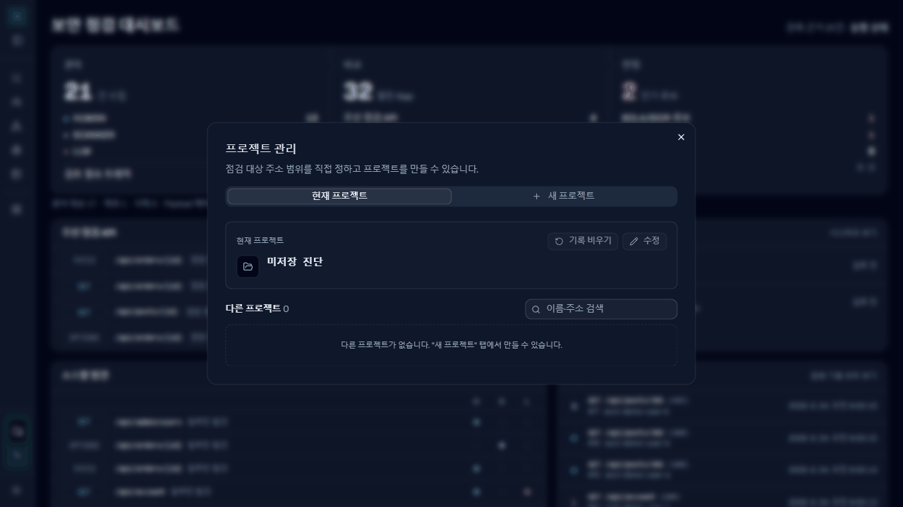
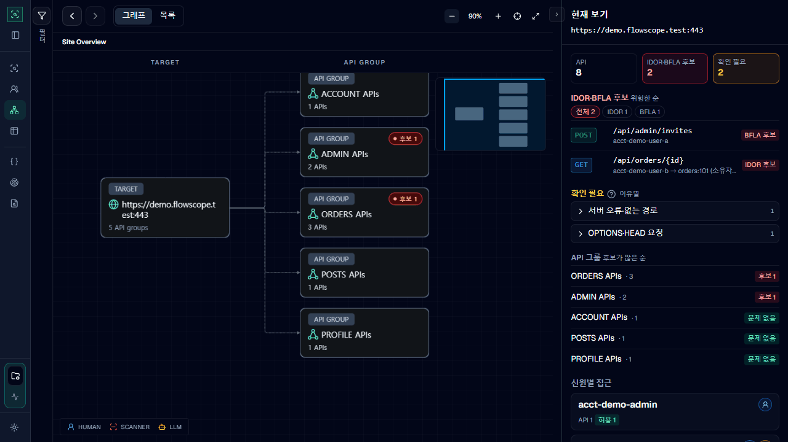

# 다음 릴리스 (미배포)

`v1.2.0-beta.50` 태그(2026-09-30) 이후 QA_TEMP에 들어간 변경입니다. 아직 배포하지 않았으므로 beta.50을 설치해도 아래 기능이 모두 들어 있지는 않습니다.

> 릴리스 전 확인: `pom.xml`이 이미 `1.2.0-beta.50`이지만 같은 이름의 태그가 이전 커밋에 있습니다. [릴리스 절차](../RELEASE.md)의 "태그와 pom 버전은 1:1" 규칙에 따라 다음 버전 번호로 올린 뒤 태그를 답니다.

## 주요 변경

### ZAP이 로그인 뒤 화면도 더 넓게 탐색

ZAP이 로그인 전 화면만 보고 끝내지 않도록, 로그인 뒤 화면을 탐색하는 방법을 바꿨습니다.

- 로그인 직후 ZAP의 브라우저 기반 탐색기(Client Spider)가 기억하는 화면 목록을 비웁니다. 로그인 뒤 메뉴와 버튼도 다시 누르도록 하기 위해서입니다.
- 이미 받은 JavaScript 번들에서 찾은 화면 경로와, 목록 응답에 실제로 나온 ID로 만든 상세 화면 주소(`/post?post_id=…`, `/post/:id`)를 탐색 시작 주소로 넣습니다.
- 첫 탐색 뒤 새 상세 주소가 생기면 그 주소를 따라 다시 탐색합니다. 최대 3회 반복합니다.
- Client Spider 다음에는 일반 탐색기(Traditional Spider)를 같은 계정으로 돌립니다. HTML과 JavaScript 원문에 적힌 주소를 `GET`으로만 따라가며, 깊이는 5단계, 시간은 최대 10분으로 제한합니다. 로그아웃이나 삭제 경로는 제외합니다.

### LLM 탐색: 브라우저 로그인과 브라우저 탐색

계정마다 **브라우저 로그인**을 누르면 FlowScope가 별도 Chromium 창을 띄우고, 사용자가 그 창에서 직접 로그인합니다. 비밀번호는 FlowScope에 넣지 않습니다. LLM은 그 창을 조작해 단일 페이지 앱이 실제로 보내는 요청까지 관측합니다. 동작 횟수나 시간 상한에 닿거나 창을 닫으면 탐색이 끝납니다.

### 프로젝트 관리 창

사이드바 맨 아래 **프로젝트 관리**에서 새 프로젝트를 만들고, 이름과 점검 범위를 수정할 수 있습니다. 다른 프로젝트를 열거나 기록을 비우고 프로젝트를 삭제하는 일도 여기서 합니다. 화면 위쪽 상태 표시줄은 없앴습니다. 점검 범위, 직접 둘러보기와 ZAP 상태는 사이드바의 **실시간 상태**에서 봅니다.

### 그래프 요약 패널

그래프 오른쪽 패널에서 지금 보는 사이트나 API 그룹의 요약을 볼 수 있습니다. IDOR와 BFLA 후보는 위험한 순서로, API 그룹은 후보가 많은 순서로 정렬합니다. 확인이 필요한 이유와 계정별 접근 결과도 함께 보여 줍니다.

## 추가

- 그래프 필터에 **보기 범위**를 추가했습니다. **관측 전체**를 고르면 정적 파일과 CORS 사전 요청만 빼고 관측한 요청을 모두 그립니다. PHP 같은 서버 렌더링 화면도 함께 보입니다. 추가로 보이는 요청은 `OBSERVED` 카드로 표시하며 판정에는 쓰지 않습니다. Request Lab에서 다시 보낸 요청이나 재전송 결과는 그리지 않고, 탐색 중 그대로 관측한 요청만 그립니다. 판정하지 않은 관측 요청이 있는 묶음은 "문제 없음" 대신 "판정 없음"으로 표시합니다. 기본값은 지금과 같은 **핵심 API만**입니다.
- 객체를 만든 요청을 보낸 계정을 소유자를 판단하는 근거로 사용합니다.
- 그래프에서 옮긴 카드의 위치와 크기, 확대 상태, 펼친 묶음을 프로젝트마다 저장합니다. 다른 화면에 다녀오거나 프로젝트를 다시 열어도 그대로 보입니다.
- LLM 탐색에서 실행마다 Codex 모델을 고를 수 있습니다. PC 전체의 Codex 설정은 바꾸지 않고, 완료 후 다음 실행의 모델을 다시 선택할 수 있습니다. Explorer는 Codex만 지원합니다.
- ZAP 로그인 설정 창에서 메모리에 저장해 둔 ID와 비밀번호를 다시 볼 수 있습니다. 입력값을 따로 저장하지 않아도 **로그인 검증**을 할 수 있습니다.

## 변경

- FlowScope가 직접 보내는 요청은 Burp Repeater처럼 대상 서버 인증서를 검증하지 않습니다. 요청 실험실, 교차 신원 재전송, LLM 탐색이 여기에 해당합니다. 자체 서명 인증서를 쓰는 실험실 대상에서도 동작합니다.
- Burp **FlowScope** 탭을 웹 화면 열기 중심으로 줄였습니다. 범위 입력칸, **범위 적용**, **새 트래픽 진단 시작**은 없어졌고, 새 프로젝트와 점검 범위는 웹 화면의 **프로젝트 관리**에서 정합니다. **FlowScope Web UI 열기** 옆에 주소와 **주소 복사**가 생겼습니다. **샘플 프로젝트**, **로컬 DB 저장·연결**, **JSON 내보내기** 같은 파일 작업과 현재 범위는 접혀 있는 **프로젝트 도구** 안에 있습니다.
- LLM 탐색의 모델 선택을 제목 옆 **탐색 모델**로 옮겼습니다. 한 번 실행한 뒤에는 **다음 탐색 모델**로 표시됩니다.
- 사이트 전체 보기에서는 그래프 필터에 따른 강조를 적용하지 않습니다.
- 그래프의 API 묶음 화면은 의심·충돌·확인 필요·쓰기 기능만 카드로 그리고, 나머지는 **신호 없는 기능 N개** 카드로 접습니다. 펼치면 모두 보입니다.
- **관측 전체**에서 JS 코드에서 찾았지만 아직 요청하지 않은 API를 `미요청 · JS에서 발견` 카드로 보여 줍니다.
- 그래프에서 `/login.php`, `/dashboard`처럼 혼자 묶음을 차지하던 한 칸짜리 주소를 서버별 **ROOT APIs** 묶음으로 모읍니다. PHP처럼 파일마다 묶음이 하나씩 생겨 사이트 화면이 흩어지던 문제를 줄입니다. 판정과 저장 데이터는 바뀌지 않습니다.
- ZAP 연결 상태와 로그인 상태를 구분해서 표시합니다. 스캔 중에는 연결 실패로 표시하지 않습니다.
- JavaScript 분석에 쓰는 별도 프로세스를 입력 128개까지 다시 사용해 분석 시간을 줄였습니다.
- 교차 신원 검증은 사이드바의 **부가 기능**으로 옮겼습니다. 취약점 시나리오와 실행 상태는 사이드바에 표시하지 않으며 주소로 열 수 있습니다.
- 계정별 기록 건수와 요청 표, API 비교와 관측 기록 상세를 정리했습니다. **이 계정으로 수집**은 선택한 계정의 직접 둘러보기로 이동할 뿐, 수집을 시작하거나 이전 실행 결과를 지우지는 않습니다.

## 제거

- LLM 탐색 계정에 로그인 URL, ID, 비밀번호를 넣어 자동으로 로그인하던 방식을 없앴습니다. 별도 브라우저 창에서 직접 로그인하는 방식으로 바뀌었습니다.

## 수정

- 그래프에서 묶음을 펼치면 하위 카드가 묶음 카드에서 멀리 떨어진 레인 맨 아래에 쌓이고, 접기 버튼도 카드와 떨어져 보이던 문제를 고쳤습니다. 이제 하위 카드는 묶음 카드 바로 아래에 붙고, 묶음 카드를 끌면 함께 움직입니다. **신호 없는 기능** 묶음의 접기 버튼에 내부 ID가 그대로 보이던 문제도 고쳤습니다.
- 노드가 많은 그래프에서 **그래프 맞추기**가 40% 아래로 축소되면 배치 저장이 거부되고 "잘못된 그래프 작업 상태입니다" 오류가 뜨던 문제를 고쳤습니다. 그래프 맞추기도 휠·버튼과 같은 40%~200% 범위 안에서만 확대·축소합니다.
- 실제 서비스의 압축된 JavaScript 번들에서 API 호출 경로를 하나도 찾지 못하던 문제를 고쳤습니다.
- 프로젝트 저장에 실패하던 문제와 JavaScript 분석 캐시가 메모리를 계속 차지하던 문제를 고쳤습니다.

## 업그레이드 주의

- SQLite 저장 형식(storage schema 3)은 그대로지만, 그래프 배치를 저장하면서 프로젝트 데이터 형식이 6에서 7로 바뀌었습니다. 새 버전은 이전 프로젝트를 그대로 엽니다. 반대로 새 버전에서 저장한 프로젝트와 JSON 내보내기는 beta.50에서 열리지 않습니다(`unsupported FlowScope schema version`). 이전 버전으로 돌아갈 수도 있다면, 업그레이드하기 전에 이전 버전에서 프로젝트를 따로 저장해 두세요.
- LLM 탐색 계정은 업그레이드 후 **브라우저 로그인**으로 다시 연결해야 합니다.
