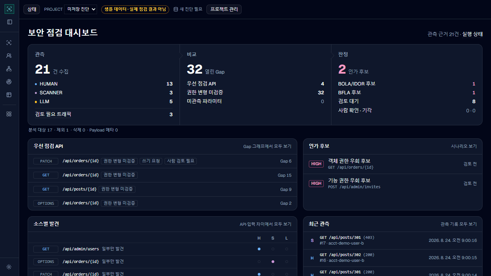
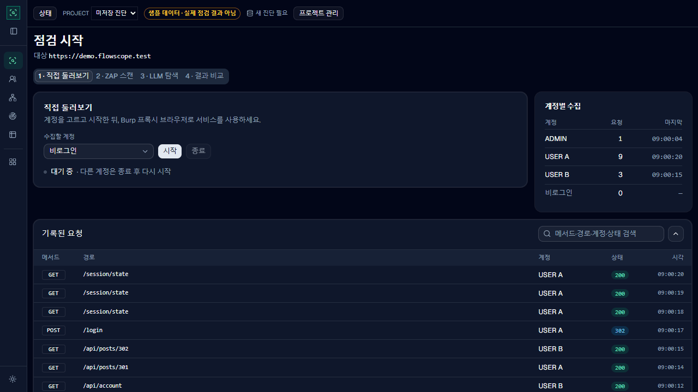
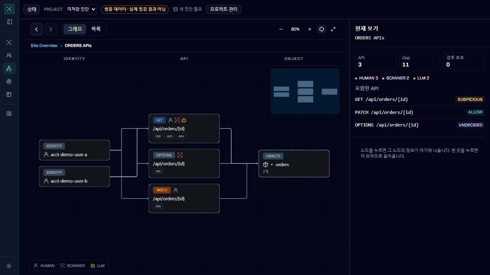
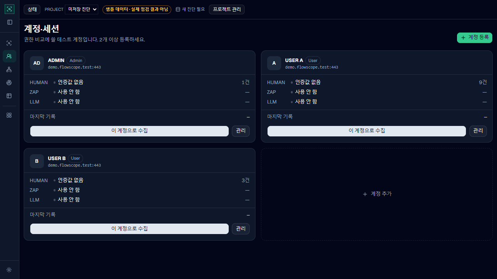
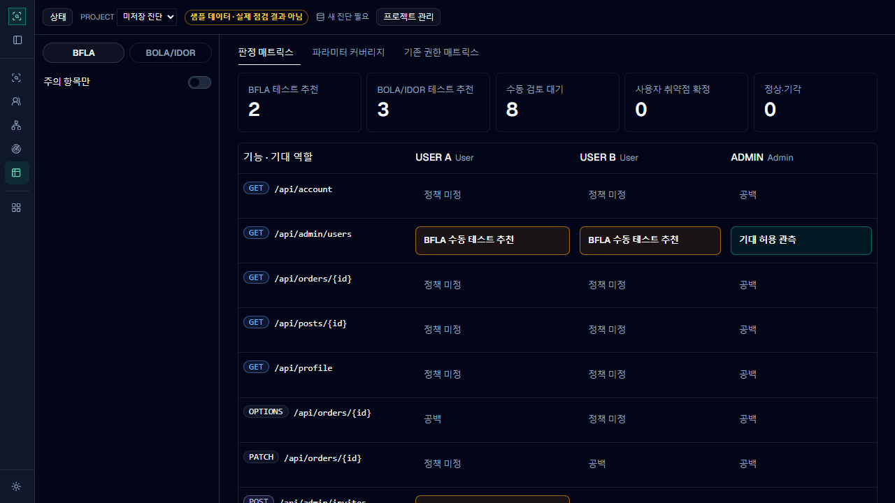

# v1.2.0-beta.50

태그 날짜: 2026-09-30 (`v1.2.0-beta.50`)

beta.49(2026-09-13) 이후 이 태그까지 들어간 변경을 정리했습니다. 태그 뒤에 들어간 변경은 [다음 릴리스](unreleased.md)에 있습니다.

웹 화면을 처음부터 다시 짜고, 계정·세션과 권한 판정 흐름을 새로 만들었습니다. 다른 계정으로 요청을 다시 보내 보는 교차 신원 검증 화면이 생겼습니다.

## 주요 변경

### 대시보드와 사이드바

Home을 대시보드로 바꿨습니다. 우선 점검할 API, 권한 취약점 후보, 사람과 ZAP, AI가 각각 찾은 API, 최근 요청 기록을 한 화면에서 보고 상세 화면으로 이동할 수 있습니다. 사이드바에는 자주 쓰는 화면을 두고 나머지는 **부가 기능**으로 묶었습니다. 아이콘만 보이도록 접을 수 있고, 라이트 테마와 다크 테마를 지원합니다.

### 점검 시작을 한 화면으로

직접 둘러보기, ZAP 스캔, LLM 탐색을 한 화면의 단계로 묶었습니다. 직접 둘러보기와 ZAP의 작업 기록은 Burp에 실제로 들어온 요청을 한 줄씩 보여 줍니다.

### 그래프 개편

사이트에서 API 그룹, 개별 API, 객체 순서로 들어가며 봅니다. 여기서 객체는 주문이나 게시글처럼 ID로 구분하는 데이터입니다. 노드를 한 번 누르면 요약을 보고, 두 번 누르면 해당 단계로 들어갑니다.

메서드 표시 옆에 그 API에 접근한 사람, 스캐너, LLM 아이콘이 붙습니다. 응답 코드와 객체 묶음을 표시하고, 전체 위치를 보는 미니맵도 추가했습니다. 그래프의 열 너비와 노드 크기를 직접 조절할 수 있고, **목록** 탭에서는 같은 경로 형식끼리 묶인 표로 봅니다. 객체 소유자는 그래프에서 바로 지정하고, 누구나 읽어도 되는 객체는 **공개**로 표시합니다.

### 계정·세션 재설계

계정을 카드로 보여 주고, 계정마다 직접 둘러보기, ZAP 스캔, LLM 탐색의 로그인 설정을 한 창에서 관리합니다. Burp에서 확인한 요청으로 계정의 세션을 직접 등록할 수 있어, 같은 브라우저에서 계정을 바꿔도 이전 계정 세션을 다시 쓸 수 있습니다.

세션이 살아 있는지(ACTIVE)와 이를 어떻게 확인했는지는 따로 표시합니다. 확인 방법은 운영자가 직접 확인했는지, 설정한 규칙으로 확인했는지, 제한된 근거만 있는지(약검증)로 나뉩니다.

### 권한 판정 매트릭스

어떤 역할이 어떤 기능을 쓸 수 있는지(BFLA), 어떤 계정이 어떤 데이터에 접근할 수 있는지(BOLA/IDOR)를 표로 보여 줍니다. 각 칸에는 허용 또는 거부돼야 하는 기대 결과와 실제 결과, 설정한 정책, 실행 기록, 소유자 판단 근거가 함께 나옵니다.

칸을 누르면 역할과 정책을 정하고, Burp Repeater로 보내고, 사람이 최종 판정을 남길 수 있습니다. 테스트 추천이 없는 칸도 Repeater 초안으로 열 수 있습니다.

### 교차 신원 검증

새 **교차 신원 검증** 화면에서 기록된 요청을 다른 등록 계정이나 비로그인 상태로 다시 보내 응답을 비교합니다. `GET`과 `HEAD`만 자동으로 보내고 나머지 메서드는 Repeater 초안만 만듭니다.

## 추가

- 페이지가 불러오는 CDN의 JavaScript 파일과 소스맵에서도 API 경로를 찾습니다.
- ZAP 계정마다 크롤링 없이 로그인만 다시 하는 **세션 갱신**을 추가했습니다.
- 요청 실험실에서 응답 결과와 실패한 시도를 이력으로 볼 수 있습니다.
- 관측 기록에 메인, 검토, 숨김 탭을 추가하고 검토 결과를 남길 수 있게 했습니다.
- 그래프에서 객체를 누르면 그 객체에 접근한 계정이 보입니다.

## 변경

- 화면에서 쓰던 "Evidence"를 **관측 기록**으로 바꾸고, 긴 ID 대신 기록 번호를 표시합니다.
- ZAP의 성공 응답만으로 로그인을 확인하지 않습니다. 다시 쓸 수 있는 인증값이 실제로 관측돼야 성공으로 처리하고, 실패하면 비로그인으로 바꾸지 않고 멈춥니다.
- 직접 둘러보기 기록을 실제 요청이 들어온 Burp 리스너 포트에 연결했습니다.
- 중첩 경로의 PWA manifest와 출처를 알 수 없는 CDN 파일이 API 목록과 후보를 불필요하게 늘리지 않도록 했습니다.

## 수정

- JavaScript 응답의 비밀값을 가릴 때 문법이 깨져 분석에 실패하던 문제를 고쳤습니다.
- Windows PowerShell 5.1에서 ZAP 실행 스크립트가 시작 전에 멈추던 문제를 고쳤습니다. 관리자 권한 없이도 ZAP API key 파일의 접근 권한을 제한합니다.
- 그래프를 누를 때 깜빡이거나 상세 창을 열면 그래프 크기가 바뀌던 문제를 고쳤습니다. Esc를 누르거나 빈 곳을 클릭하면 선택이 풀립니다.
- 라이트 모드에서 글자를 읽기 쉽게 다듬었습니다.

## 업그레이드 주의

- 저장 형식(storage schema 3)은 바뀌지 않았습니다.
- 계정 세션은 메모리에만 있으므로 새 버전을 로드한 뒤 로그인 연결을 다시 해야 합니다.
- 이 태그가 가리키는 커밋의 `pom.xml`은 `1.2.0-beta.49`로 남아 있습니다. 태그에서 직접 빌드하면 파일 이름이 `flowscope-1.2.0-beta.49.jar`로 나옵니다.
